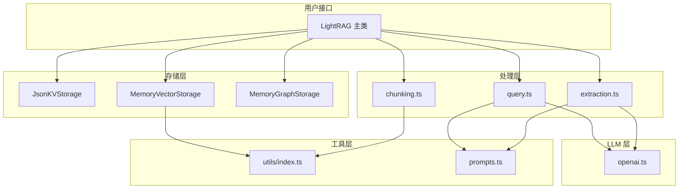

# LightRAG TypeScript 文档

## 概述

本目录包含 LightRAG TypeScript 实现的完整 API 文档。

## 文档索引

### 核心模块

| 文件                           | 模块             | 说明                |
| ------------------------------ | ---------------- | ------------------- |
| [constants.md](./constants.md) | `constants.ts`   | 配置常量            |
| [types.md](./types.md)         | `types.ts`       | TypeScript 类型定义 |
| [prompts.md](./prompts.md)     | `prompts.ts`     | LLM 提示词模板      |
| [utils.md](./utils.md)         | `utils/index.ts` | 工具函数            |

### 存储模块

| 文件                                                   | 模块                       | 说明          |
| ------------------------------------------------------ | -------------------------- | ------------- |
| [storage-base.md](./storage-base.md)                   | `storage/base.ts`          | 存储接口定义  |
| [storage-json-kv.md](./storage-json-kv.md)             | `storage/json-kv.ts`       | JSON 键值存储 |
| [storage-memory-vector.md](./storage-memory-vector.md) | `storage/memory-vector.ts` | 内存向量存储  |
| [storage-memory-graph.md](./storage-memory-graph.md)   | `storage/memory-graph.ts`  | 内存图存储    |

### LLM 模块

| 文件                             | 模块            | 说明        |
| -------------------------------- | --------------- | ----------- |
| [llm-openai.md](./llm-openai.md) | `llm/openai.ts` | OpenAI 集成 |

### 操作模块

| 文件                                             | 模块                    | 说明         |
| ------------------------------------------------ | ----------------------- | ------------ |
| [operate-chunking.md](./operate-chunking.md)     | `operate/chunking.ts`   | 文本分块     |
| [operate-extraction.md](./operate-extraction.md) | `operate/extraction.ts` | 实体关系提取 |
| [operate-query.md](./operate-query.md)           | `operate/query.ts`      | 查询管道     |

### 主类

| 文件                         | 模块          | 说明           |
| ---------------------------- | ------------- | -------------- |
| [lightrag.md](./lightrag.md) | `lightrag.ts` | 主 LightRAG 类 |
| [index.md](./index.md)       | `index.ts`    | 模块导出       |

## 快速开始

```typescript
import LightRAG from "lightrag-ts";

const rag = new LightRAG({
  workingDir: "./data",
  entityTypes: ["Person", "Organization", "Location"],
});

await rag.initialize();
await rag.insert("文档内容...");
const result = await rag.query("问题?");
console.log(result.response);
await rag.finalize();
```

## 架构图



## 数据流

### 插入流程

```
文档 → 分块 → 嵌入 → 存储块
        ↓
     LLM 提取
        ↓
   实体 + 关系
        ↓
   图存储 + 向量存储
```

### 查询流程

```
查询 → 关键词提取 → 向量搜索 → 图遍历
                          ↓
                     合并上下文
                          ↓
                     LLM 生成
                          ↓
                        响应
```
