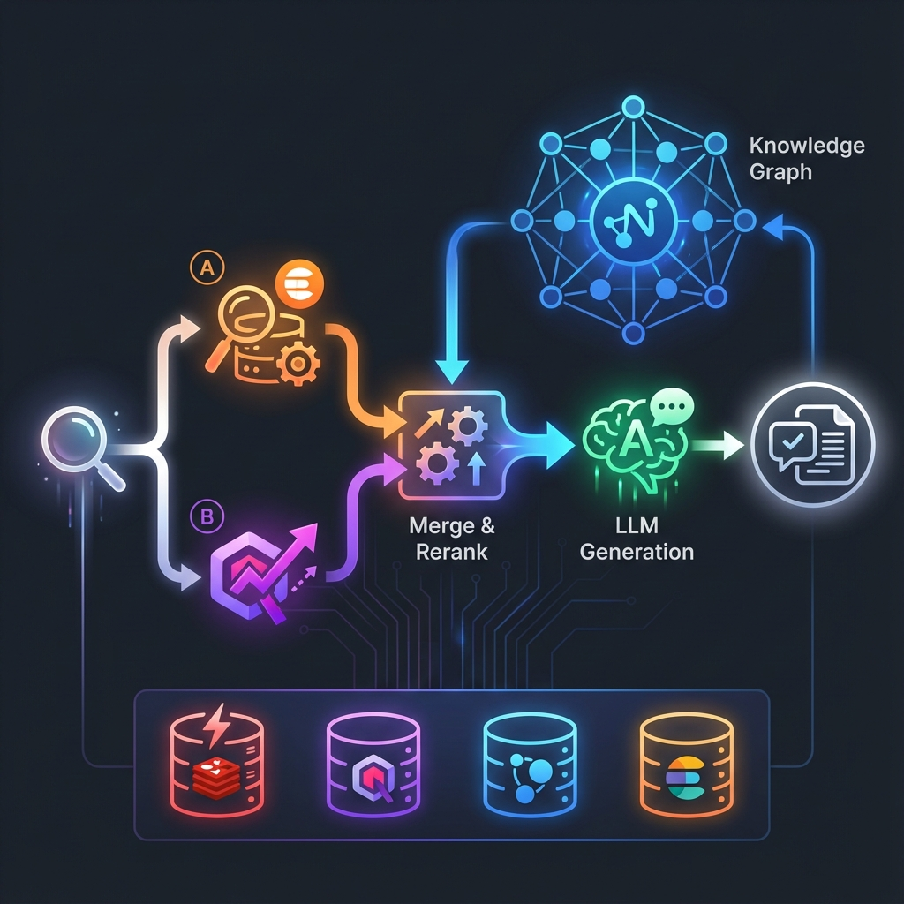

# BM25 Hybrid Search 评估报告

本文档记录了 LightRAG TypeScript 版本添加 Elasticsearch BM25 混合搜索后的评估结果。

## 架构概述



**流程说明：**

1. 🔍 **User Query** → 用户查询入口
2. 🅰️ **BM25 Search** (Elasticsearch) → 关键词匹配
3. 🅱️ **Vector Search** (Qdrant) → 语义相似度
4. ⚙️ **Merge & Rerank** → 结果融合与重排序
5. 🧠 **Knowledge Graph** (Neo4j) → 知识图谱增强
6. 🤖 **LLM Generation** (OpenAI) → 答案生成
7. 📄 **Response** → 最终响应

## 评估结果对比

| 指标                  | 无 BM25 | 有 BM25  | 变化        |
| :-------------------- | :-----: | :------: | :---------- |
| **Faithfulness**      |  0.87   | **0.88** | 🟢 +1%      |
| **Answer Relevancy**  |  0.94   | **0.96** | 🟢 +2%      |
| **Context Precision** |  0.50   | **0.83** | 🟢 **+66%** |
| **Context Recall**    |  0.61   | **0.94** | 🟢 **+54%** |

## 关键发现

### BM25 显著提升检索质量

1. **Context Recall: 0.61 → 0.94** (+54%)

   - BM25 关键词匹配帮助找到向量搜索可能遗漏的相关 chunks
   - 特别是包含精确术语（如 "GraphRAG", "LightRAG"）的内容

2. **Context Precision: 0.50 → 0.83** (+66%)
   - 关键词匹配过滤掉语义相似但不相关的内容
   - 减少了 "false positive" 检索结果

### Vector + BM25 互补机制

| 搜索方式          | 优势                   | 适用场景                                             |
| :---------------- | :--------------------- | :--------------------------------------------------- |
| **Vector Search** | 语义理解、同义词匹配   | "RAG 是什么" → 找到 "Retrieval Augmented Generation" |
| **BM25 Search**   | 精确关键词匹配、稀有词 | "GraphRAG vs LightRAG" → 精确找到包含这两个词的文档  |
| **Hybrid (推荐)** | 两者优势结合           | 同时捕获语义相似和精确匹配                           |

## 配置说明

### Docker 服务

```yaml
# docker-compose.yml
elasticsearch:
  image: docker.elastic.co/elasticsearch/elasticsearch:8.11.0
  ports:
    - "9200:9200"

kibana: # 管理 UI
  image: docker.elastic.co/kibana/kibana:8.11.0
  ports:
    - "5601:5601"
```

### 使用方法

```typescript
// 启用 BM25 混合搜索
const result = await rag.query("your question", {
  mode: "hybrid",
  enableBM25: true, // 启用 Elasticsearch BM25
  topK: 5,
  enableRerank: true,
});
```

### BM25 参数

| 参数 | 默认值 | 说明               |
| :--- | :----- | :----------------- |
| k1   | 1.2    | 词频饱和参数       |
| b    | 0.75   | 文档长度归一化参数 |

## 管理 UI 访问

| 服务              | URL                             |
| :---------------- | :------------------------------ |
| Elasticsearch API | http://localhost:9200           |
| Kibana Dashboard  | http://localhost:5601           |
| Neo4j Browser     | http://localhost:7474           |
| Qdrant Dashboard  | http://localhost:6333/dashboard |

## 结论

**强烈推荐启用 BM25 混合搜索**：

- 对于技术文档、代码、专有名词密集的场景，BM25 提供关键词精确匹配
- 与 Vector Search 结合，实现语义 + 关键词双重检索
- Context Recall 和 Precision 提升显著（54% 和 66%）
