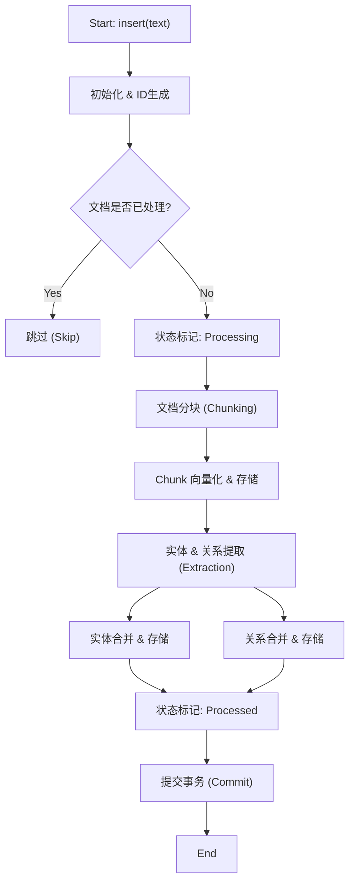
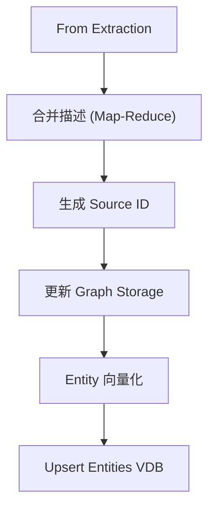
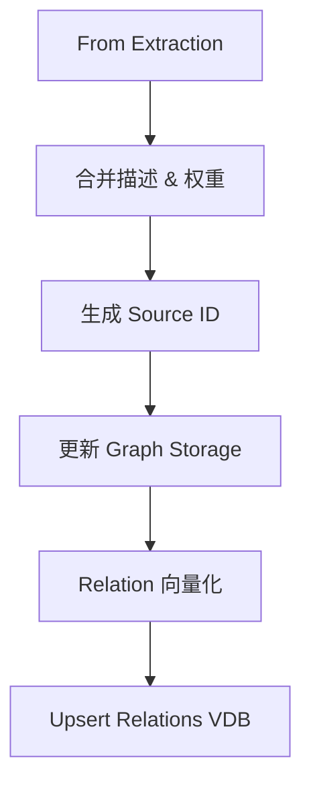

# 01. 初始数据摄入流程 (Initial Data Ingestion)

本文档详细解释 LightRAG 系统中数据摄入的完整流程。该过程将原始文本转化为向量数据库中的 Chunk、以及知识图谱中的实体（Entities）和关系（Relations）。

## 核心流程图

### 1. 主流程 (Main Process)

### 2. 实体处理子流程 (Entity Processing)

### 3. 关系处理子流程 (Relation Processing)

## 详细步骤解析

### 1. 初始化与预处理

**主要函数**: `LightRAG.insert()`, `computeMdhashId()`

- **输入**: 原始文本字符串或字符串数组。
- **ID 生成**: 对每个文档内容计算 MD5 哈希作为 `doc_id` (前缀 `doc-`)。
- **状态检查**: 查询 `docsKv` 存储，检查该 `doc_id` 是否标为 `processed`。如果是，则直接跳过，实现增量更新的基础去重。

### 2. 文档状态标记

**主要函数**: `docsKv.upsert()`

- 在开始处理前，将文档状态写入 KV 存储，标记为 `processing`。这用于系统崩溃后的恢复或状态追踪。

### 3. 文档分块 (Chunking)

**主要函数**: `chunkingByTokenSize()`, `addDocIdToChunks()`

- **作用**: 将长文本切分为适合 LLM 处理的小块。
- **逻辑**: 基于 Token 数量（默认 1200 tokens）进行切分，包含重叠部分（Overlap，默认 100 tokens）以保持上下文连贯。
- **增强**: 为每个 Chunk 附加所属的 `doc_id`。
- **存储**: 计算 Chunk 哈希 (`chunk-`)，存入 `chunksKv`。

### 4. Chunk 向量化

**主要函数**: `embeddingFunc()`, `chunksVdb.upsert()`

- **向量化**: 调用 Embedding 模型 API（如 OpenAI text-embedding-3）获取每个 Chunk 的向量表示。
- **存储**: 将向量、原始内容、元数据（doc_id, file_path）存入 `chunksVdb` (Vector Database)。

### 5. 实体与关系提取 (Extraction)

**主要函数**: `extractFromChunks()`, `prompts.ts`

- **并发处理**: 对 Chunks 并行调用 LLM。
- **Gleaning (拾遗)**: 如果单次提取不完整，会触发 Gleaning 机制，多轮次询问 LLM 以确保信息完整性。
- **Prompt**: 使用 `entityExtraction` 提示词，要求 LLM 输出 JSON 格式的实体（名称、类型、描述）和关系（源、目标、描述、权重）。

### 6. 实体合并与存储 (Entity Merge & Store)

**主要函数**: `mergeEntityDescriptions()`, `graphStorage.upsertNode()`, `entitiesVdb.upsert()`

- **Map-Reduce 摘要**: 同一实体可能在不同 Chunk 中被提取多次。系统收集所有描述，使用 LLM (`summarizeEntityDescriptions` prompt) 生成一个综合的、去重的摘要。
- **Source ID 聚合**: 将所有来源 Chunk 的 ID 合并记录（`chunk-a<SEP>chunk-b`），用于溯源。
- **图存储**: 在 Graph 数据库（如 Neo4j 或内存图）中创建或更新节点。
- **向量存储**: 对实体的**摘要描述**进行向量化，存入 `entitiesVdb`。

### 7. 关系合并与存储 (Relation Merge & Store)

**主要函数**: `mergeRelationDescriptionsSimple()`, `graphStorage.upsertEdge()`, `relationsVdb.upsert()`

- **权重累加**: 如果关系已存在，累加权重。
- **描述合并**: 简单的文本拼接或 LLM 摘要。
- **图存储**: 在 Graph 数据库中创建或更新边（Edge）。
- **向量存储**: 对关系的描述进行向量化，存入 `relationsVdb`。这一步是 LightRAG 的特色，允许通过向量搜索直接检索关系。

### 8. 事务提交

**主要函数**: `commitChanges()`, `docsKv.upsert()`

- 更新文档状态为 `processed`。
- 触发所有存储引擎的持久化操作（如写入 JSON 文件）。
