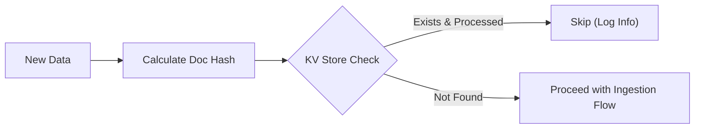
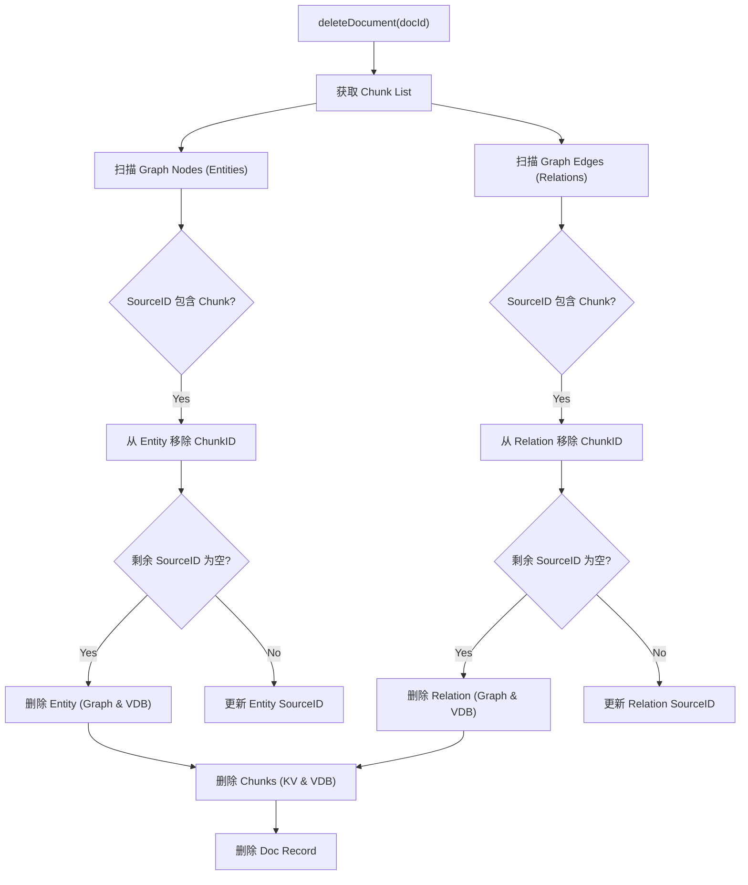

# 02. 数据更新与删除流程 (Update & Delete Data)

LightRAG 不支持直接的"原地修改"。数据更新通常通过**增量插入 (Incremental Insert)** 或 **删除后重新插入 (Delete then Insert)** 来实现。

## A. 增量数据插入 (Incremental Insert)

当你调用 `insert()` 方法时，系统会自动处理增量数据。

### 流程图

### 机制解释

正如 `01_initial_data_ingestion.md` 中所述，`insert` 的第一步是计算文档内容的哈希（MD5）。

- **去重**: 如果内容未变，哈希值相同，系统会检测到 `docsKv` 中已存在且状态为 `processed`，从而跳过重复处理。
- **新增**: 如果是新文件或内容变更（导致哈希改变），则视为新文档进行处理。

---

## B. 数据删除流程 (Data Deletion)

删除文档是一个复杂的操作，因为文档的 Chunk 数据分散在 Chunk Vector DB、Graph Nodes 和 Graph Edges 中。

**主要函数**: `LightRAG.deleteDocument(docId)`

### 核心流程图

### 详细步骤解析

### 1. 获取关联 Chunks

**主要函数**: `docsKv.getById()`

- 从 `docsKv` 中读取文档元数据，获取该文档包含的所有 `chunksList` (Chunk IDs)。

### 2. 影响范围分析 (Impact Analysis)

**主要函数**: `graphStorage.getAllNodes()`, `graphStorage.getAllEdges()`

- **遍历图谱**: 系统需要扫描图中的所有节点（实体）和边（关系）。
- **检查 Source ID**: 每个节点/边都有 `source_id` 字段（例如 `chunk-1<SEP>chunk-2`）。系统检查这些 ID 是否属于待删除的文档。

### 3. 清理实体引用 (Clean Entities)

**主要函数**: `removeChunkReferencesFromEntity()`

- **逻辑**:
  1.  从实体的 `chunks_count` 或 `source_id` 列表中移除目标 Chunk ID。
  2.  **孤儿清理**: 如果移除后，该实体**不再关联任何 Chunk**（即 `source_id` 为空），说明该实体仅由被删除的文档贡献。
  3.  **执行删除**: 如果是孤儿节点，从 `Graph Storage` 和 `Entities VDB` 中物理删除。
  4.  **执行更新**: 如果仍有其他文档引用该实体，仅更新其元数据（去除引用）。

### 4. 清理关系引用 (Clean Relations)

**主要函数**: `removeChunkReferencesFromRelation()`

- **逻辑**: 同实体清理逻辑。
- 检查关系的 `source_id`。如果移除目标 Chunk 后为空，则从 `Graph Storage` 和 `Relations VDB` 中物理删除该关系。

### 5. 删除 Chunk 数据

**主要函数**: `chunksKv.delete()`, `chunksVdb.delete()`

- 从 Key-Value 存储和 Vector 数据库中物理删除属于该文档的所有 Chunk。

### 6. 删除文档记录

**主要函数**: `docsKv.delete()`

- 最后，从 `docsKv` 中移除文档本身的记录。

---

## C. 重建索引 (Rebuild) - _Planned_

目前的 TypeScript 版本实现了基础的删除逻辑。完整的 `rebuild`（即修改文档后，不仅删除旧的，还要重新计算受影响实体的摘要）是一个昂贵的操作，目前主要通过 **Delete Old Doc -> Insert New Doc** 的方式手动完成。

如果在 `deleteDocument` 时传入 `{ rebuildGraph: true }`，系统目前会记录日志，并未完全实现全图实体的重新摘要（因为这需要重新读取所有相关 Chunk 并再次调用 LLM）。
