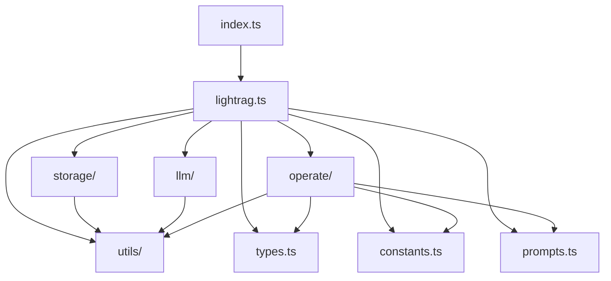

# index.ts - 模块导出

## 概述

LightRAG 库的主入口点，导出所有公共 API。

## 导出结构

### 主类

```typescript
export { LightRAG, default } from "./lightrag.js";
```

### 类型

```typescript
export type {
  // 查询相关
  QueryParam,
  QueryMode,
  QueryResult,
  QueryRawData,
  ChatMessage,

  // 数据结构
  TextChunk,
  Entity,
  Relation,
  DocumentStatus,

  // 知识图谱
  KnowledgeGraph,
  KnowledgeGraphNode,
  KnowledgeGraphEdge,

  // 函数类型
  LLMFunction,
  EmbeddingFunction,

  // 配置
  LightRAGConfig,
  InsertOptions,
  LLMConfig,
  EmbeddingConfig,
} from "./types.js";
```

### 存储

```typescript
// 实现类
export {
  JsonKVStorage,
  MemoryVectorStorage,
  MemoryGraphStorage,
} from "./storage/index.js";

// 接口类型
export type {
  BaseKVStorage,
  BaseVectorStorage,
  BaseGraphStorage,
  VectorData,
  VectorQueryResult,
  StorageConfig,
} from "./storage/index.js";
```

### LLM

```typescript
export {
  openaiComplete,
  openaiEmbed,
  createOpenAIComplete,
  createOpenAIEmbed,
  gpt4oComplete,
  gpt4oMiniComplete,
} from "./llm/index.js";
```

### 操作函数

```typescript
export {
  chunkingByTokenSize, // 文本分块
  extractFromChunk, // 单块提取
  extractFromChunks, // 批量提取
  extractKeywords, // 关键词提取
  kgQuery, // 知识图谱查询
} from "./operate/index.js";
```

### 工具函数

```typescript
export {
  GPTTokenizer, // 分词器
  computeMdhashId, // 哈希 ID
  cosineSimilarity, // 余弦相似度
  logger, // 日志工具
} from "./utils/index.js";
```

### 常量

```typescript
export {
  GRAPH_FIELD_SEP,
  DEFAULT_ENTITY_TYPES,
  DEFAULT_TOP_K,
  DEFAULT_CHUNK_TOKEN_SIZE,
} from "./constants.js";
```

### 提示词

```typescript
export { PROMPTS, formatPrompt } from "./prompts.js";
```

## 使用方式

### 完整导入

```typescript
import LightRAG, {
  QueryParam,
  createOpenAIComplete,
  DEFAULT_ENTITY_TYPES,
} from "lightrag-ts";

const rag = new LightRAG();
```

### 按需导入

```typescript
// 只使用存储
import { JsonKVStorage, MemoryVectorStorage } from "lightrag-ts";

// 只使用 LLM
import { openaiComplete, openaiEmbed } from "lightrag-ts";

// 只使用操作
import { chunkingByTokenSize, extractFromChunks } from "lightrag-ts";
```

### 类型导入

```typescript
import type { QueryResult, TextChunk, LLMFunction } from "lightrag-ts";
```

## 模块依赖图


