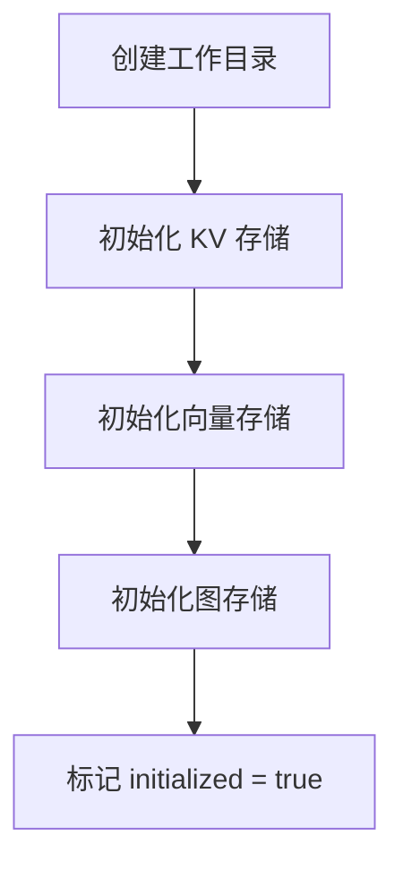
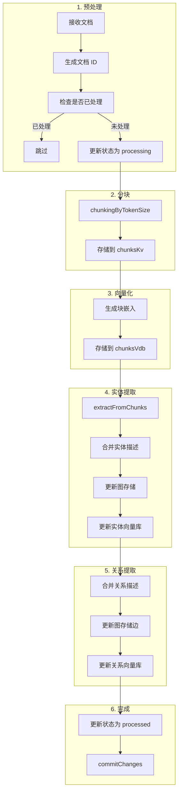

# lightrag.ts - 主类

## 概述

`LightRAG` 类是整个系统的入口点，协调文档处理、知识图谱构建和 RAG 查询。

## 类定义

```typescript
class LightRAG {
  constructor(config?: LightRAGConfig);

  // 生命周期
  async initialize(): Promise<void>;
  async finalize(): Promise<void>;

  // 核心操作
  async insert(
    input: string | string[],
    options?: InsertOptions
  ): Promise<void>;
  async query(query: string, param?: Partial<QueryParam>): Promise<QueryResult>;

  // 辅助功能
  async getKnowledgeGraph(
    nodeLabel?: string,
    maxDepth?: number,
    maxNodes?: number
  ): Promise<KnowledgeGraph>;
  async getDocumentStatus(docId: string): Promise<DocumentStatus | null>;
  async drop(): Promise<void>;
}
```

## 配置选项

```typescript
interface LightRAGConfig {
  workingDir?: string; // 工作目录，默认 './lightrag_data'
  namespace?: string; // 命名空间，默认 'default'
  llmModelFunc?: LLMFunction; // LLM 函数，默认 OpenAI
  embeddingFunc?: EmbeddingFunction; // 嵌入函数，默认 OpenAI
  embeddingDim?: number; // 嵌入维度，默认 1536
  chunkTokenSize?: number; // 分块大小，默认 1200
  chunkOverlapTokenSize?: number; // 分块重叠，默认 100
  topK?: number; // 检索数量，默认 40
  maxGleaning?: number; // gleaning 次数，默认 1
  entityTypes?: string[]; // 实体类型列表
  language?: string; // 语言，默认 'English'
  enableLlmCache?: boolean; // 启用缓存，默认 true
}
```

## 存储实例

| 存储           | 类型                | 用途     |
| -------------- | ------------------- | -------- |
| `docsKv`       | JsonKVStorage       | 文档状态 |
| `chunksKv`     | JsonKVStorage       | 文本块   |
| `entitiesKv`   | JsonKVStorage       | 实体 KV  |
| `relationsKv`  | JsonKVStorage       | 关系 KV  |
| `entitiesVdb`  | MemoryVectorStorage | 实体向量 |
| `relationsVdb` | MemoryVectorStorage | 关系向量 |
| `chunksVdb`    | MemoryVectorStorage | 块向量   |
| `graphStorage` | MemoryGraphStorage  | 知识图谱 |
| `llmCache`     | JsonKVStorage       | LLM 缓存 |

## 核心方法

### initialize()

初始化所有存储实例：



### insert(input, options?)

```typescript
async insert(
  input: string | string[],
  options?: InsertOptions
): Promise<void>
```

**InsertOptions**:

```typescript
{
  ids?: string | string[];           // 自定义文档 ID
  filePaths?: string | string[];     // 文件路径
  splitByCharacter?: string;         // 分割字符
  splitByCharacterOnly?: boolean;    // 仅按字符分割
}
```

**处理流程**:



**使用示例**:

```typescript
const rag = new LightRAG({ workingDir: "./data" });
await rag.initialize();

// 单个文档
await rag.insert("这是文档内容...");

// 多个文档
await rag.insert([doc1, doc2, doc3], {
  filePaths: ["file1.txt", "file2.txt", "file3.txt"],
});

// 按章节分割
await rag.insert(book, {
  splitByCharacter: "\n\n第",
});
```

### query(query, param?)

```typescript
async query(
  query: string,
  param?: Partial<QueryParam>
): Promise<QueryResult>
```

**使用示例**:

```typescript
// 默认 hybrid 模式
const result = await rag.query("谁发明了电话？");

// 指定模式
const result = await rag.query("谁发明了电话？", {
  mode: "local",
  topK: 10,
});

// 带对话历史
const result = await rag.query("他后来怎么样了？", {
  mode: "hybrid",
  conversationHistory: previousMessages,
});
```

### getKnowledgeGraph(nodeLabel?, maxDepth?, maxNodes?)

```typescript
async getKnowledgeGraph(
  nodeLabel: string = '*',
  maxDepth: number = 3,
  maxNodes: number = 1000
): Promise<KnowledgeGraph>
```

获取知识图谱用于可视化：

```typescript
const kg = await rag.getKnowledgeGraph("Einstein", 2, 100);
console.log(`${kg.nodes.length} nodes, ${kg.edges.length} edges`);
```

### drop()

删除所有数据：

```typescript
await rag.drop();
```

## 完整示例

```typescript
import { LightRAG } from "./lightrag.js";

async function main() {
  // 1. 创建实例
  const rag = new LightRAG({
    workingDir: "./my_project",
    namespace: "physics",
    entityTypes: ["Person", "Concept", "Discovery"],
    language: "Chinese",
  });

  // 2. 初始化
  await rag.initialize();

  // 3. 插入文档
  await rag.insert(
    `
    爱因斯坦是一位德国理论物理学家，
    他发展了相对论理论，这是现代物理学的两大支柱之一。
    1921年，他因对光电效应的解释获得诺贝尔物理学奖。
  `,
    { filePaths: "einstein.txt" }
  );

  // 4. 查询
  const result = await rag.query("爱因斯坦获得了什么奖项？", {
    mode: "hybrid",
  });
  console.log(result.response);

  // 5. 获取知识图谱
  const kg = await rag.getKnowledgeGraph("爱因斯坦", 2);
  console.log(`图谱: ${kg.nodes.length} 节点, ${kg.edges.length} 边`);

  // 6. 清理
  await rag.finalize();
}

main().catch(console.error);
```

## 数据持久化

所有数据存储在：

```
{workingDir}/{namespace}/
├── docs.json           # 文档状态
├── chunks.json         # 文本块
├── entities_kv.json    # 实体 KV
├── relations_kv.json   # 关系 KV
├── entities_vdb.json   # 实体向量
├── relations_vdb.json  # 关系向量
├── chunks_vdb.json     # 块向量
├── graph.json          # 知识图谱
└── llm_cache.json      # LLM 缓存
```
