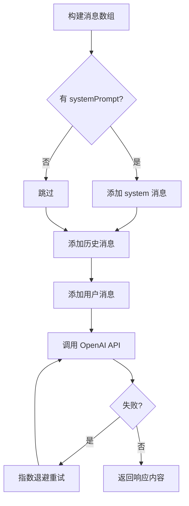

# llm/openai.ts - OpenAI 集成

## 概述

提供 OpenAI API 的封装，包括 Chat Completion 和 Embedding 生成功能。

## 核心函数

### 1. openaiComplete

```typescript
async function openaiComplete(
  prompt: string,
  options?: CompletionOptions
): Promise<string>;
```

**功能**: 调用 OpenAI Chat Completion API 生成文本响应。

**参数说明**:
| 参数 | 类型 | 默认值 | 说明 |
|------|------|--------|------|
| `prompt` | `string` | - | 用户提示 |
| `options.systemPrompt` | `string` | - | 系统提示 |
| `options.historyMessages` | `ChatMessage[]` | - | 历史对话 |
| `options.model` | `string` | `gpt-4o-mini` | 模型名称 |
| `options.temperature` | `number` | `1.0` | 温度参数 |
| `options.maxTokens` | `number` | - | 最大输出 token |
| `options.apiKey` | `string` | 环境变量 | API 密钥 |
| `options.baseUrl` | `string` | - | 自定义 API 端点 |

**工作流程**:



**使用示例**:

```typescript
import { openaiComplete } from "./llm/openai.js";

const response = await openaiComplete("写一首关于春天的诗", {
  systemPrompt: "你是一位诗人",
  model: "gpt-4o",
  temperature: 0.7,
});
```

### 2. openaiEmbed

```typescript
async function openaiEmbed(
  texts: string[],
  options?: EmbeddingOptions
): Promise<number[][]>;
```

**功能**: 生成文本嵌入向量。

**参数说明**:
| 参数 | 类型 | 默认值 | 说明 |
|------|------|--------|------|
| `texts` | `string[]` | - | 要嵌入的文本列表 |
| `options.model` | `string` | `text-embedding-3-small` | 嵌入模型 |
| `options.dimensions` | `number` | - | 向量维度（仅 v3 模型支持） |
| `options.apiKey` | `string` | 环境变量 | API 密钥 |

**使用示例**:

```typescript
import { openaiEmbed } from "./llm/openai.js";

const embeddings = await openaiEmbed(["这是第一段文本", "这是第二段文本"], {
  dimensions: 1536,
});

console.log(embeddings[0].length); // 1536
```

### 3. 工厂函数

#### createOpenAIComplete

```typescript
function createOpenAIComplete(config?: LLMConfig): LLMFunction;
```

创建预配置的 LLM 函数。

```typescript
const myLlm = createOpenAIComplete({
  model: "gpt-4o",
  temperature: 0.5,
  apiKey: "sk-xxx",
});

// 后续直接使用
const result = await myLlm("Hello");
```

#### createOpenAIEmbed

```typescript
function createOpenAIEmbed(config?: EmbeddingConfig): EmbeddingFunction;
```

创建预配置的嵌入函数。

```typescript
const myEmbed = createOpenAIEmbed({
  model: "text-embedding-3-large",
  dimensions: 3072,
});

const vectors = await myEmbed(["text1", "text2"]);
```

### 4. 便捷函数

```typescript
// GPT-4o 完成
async function gpt4oComplete(prompt: string, options?): Promise<string>;

// GPT-4o-mini 完成（默认，成本更低）
async function gpt4oMiniComplete(prompt: string, options?): Promise<string>;
```

## 重试机制

内置指数退避重试：

- 最大重试次数：3 次
- 基础延迟：1000ms
- 延迟公式：`baseDelay * 2^attempt`

```typescript
// 第 1 次失败 → 等待 1s
// 第 2 次失败 → 等待 2s
// 第 3 次失败 → 抛出错误
```

## 环境变量

| 变量名                   | 说明                 |
| ------------------------ | -------------------- |
| `OPENAI_API_KEY`         | OpenAI API 密钥      |
| `OPENAI_MODEL`           | 默认模型（可选）     |
| `OPENAI_EMBEDDING_MODEL` | 默认嵌入模型（可选） |

## 客户端管理

使用单例模式管理默认客户端：

```typescript
let defaultClient: OpenAI | null = null;

function getOpenAIClient(config?: LLMConfig): OpenAI {
  if (config?.apiKey || config?.baseUrl) {
    // 自定义配置，创建新客户端
    return new OpenAI({ ... });
  }

  if (!defaultClient) {
    // 复用默认客户端
    defaultClient = new OpenAI({ ... });
  }

  return defaultClient;
}
```
