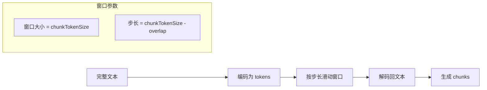
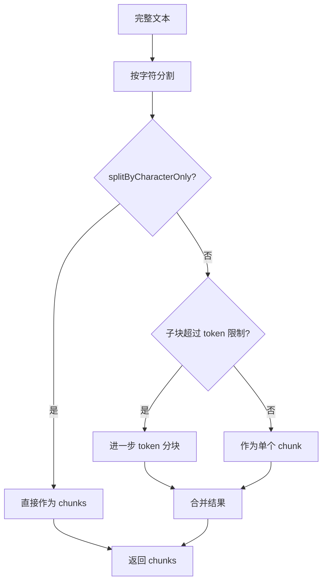

# operate/chunking.ts - 文本分块

## 概述

将长文本按 token 大小分割成可管理的块，支持重叠以保持上下文连续性。

## 核心函数

### chunkingByTokenSize

```typescript
function chunkingByTokenSize(
  tokenizer: Tokenizer,
  content: string,
  options?: ChunkingOptions
): Array<Omit<TextChunk, "fullDocId">>;
```

**参数**:
| 参数 | 类型 | 默认值 | 说明 |
|------|------|--------|------|
| `tokenizer` | `Tokenizer` | - | 分词器实例 |
| `content` | `string` | - | 要分块的文本 |
| `options.chunkTokenSize` | `number` | 1200 | 每块最大 token 数 |
| `options.chunkOverlapTokenSize` | `number` | 100 | 块间重叠 token 数 |
| `options.splitByCharacter` | `string` | - | 先按此字符分割 |
| `options.splitByCharacterOnly` | `boolean` | false | 仅按字符分割，不再细分 |

**返回值**:

```typescript
[
  { tokens: 1150, content: "...", chunkOrderIndex: 0 },
  { tokens: 1180, content: "...", chunkOrderIndex: 1 },
  // ...
];
```

## 分块策略

### 策略 1：纯 Token 分块

未指定 `splitByCharacter` 时使用。



**示例**:

```
文本: [t1 t2 t3 t4 t5 t6 t7 t8 t9 t10]
chunkTokenSize = 4
overlap = 1
步长 = 3

Chunk 0: [t1 t2 t3 t4]
Chunk 1: [t4 t5 t6 t7]  (t4 重叠)
Chunk 2: [t7 t8 t9 t10] (t7 重叠)
```

### 策略 2：字符分割 + Token 分块

指定 `splitByCharacter` 时使用。



**使用场景**:

- 按段落分割：`splitByCharacter: '\n\n'`
- 按章节分割：`splitByCharacter: '---'`

## 代码示例

### 基础用法

```typescript
import { chunkingByTokenSize } from "./operate/chunking.js";
import { GPTTokenizer } from "./utils/index.js";

const tokenizer = new GPTTokenizer();
const text = "这是一段很长的文本...";

const chunks = chunkingByTokenSize(tokenizer, text, {
  chunkTokenSize: 500,
  chunkOverlapTokenSize: 50,
});

console.log(`分成 ${chunks.length} 个块`);
chunks.forEach((c, i) => {
  console.log(`Chunk ${i}: ${c.tokens} tokens`);
});
```

### 按段落分割

```typescript
const chunks = chunkingByTokenSize(tokenizer, text, {
  splitByCharacter: "\n\n",
  chunkTokenSize: 1200,
});
```

### 仅按字符分割

```typescript
// 适用于已有分隔符的结构化文档
const chunks = chunkingByTokenSize(tokenizer, text, {
  splitByCharacter: "---SECTION---",
  splitByCharacterOnly: true, // 不再细分
});
```

### addDocIdToChunks

```typescript
function addDocIdToChunks(
  chunks: Array<Omit<TextChunk, "fullDocId">>,
  docId: string
): TextChunk[];
```

为分块添加文档 ID。

```typescript
const chunksWithId = addDocIdToChunks(chunks, "doc-abc123");
// 每个 chunk 现在有 fullDocId: 'doc-abc123'
```

## 重叠的作用

重叠确保跨块边界的信息不会丢失：

```
原文: "Einstein developed the theory of relativity in 1905."

无重叠:
  Chunk 1: "Einstein developed the theory"
  Chunk 2: "of relativity in 1905."
  问题: "theory of relativity" 被分开

有重叠:
  Chunk 1: "Einstein developed the theory of"
  Chunk 2: "of the theory of relativity in 1905."
  优点: 完整短语在两个块中都有
```

## 错误处理

当 `splitByCharacterOnly = true` 但子块超过 token 限制时抛出错误：

```typescript
throw new Error(
  `Chunk split by character exceeds token limit: ${tokens} > ${limit}`
);
```
