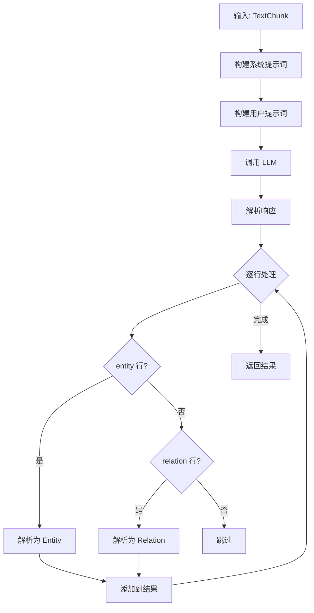

# operate/extraction.ts - 实体关系提取

## 概述

使用 LLM 从文本块中提取实体和关系，构建知识图谱。

## 核心函数

### 1. extractFromChunk

```typescript
async function extractFromChunk(
  chunk: TextChunk,
  llmFunc: LLMFunction,
  config?: ExtractionConfig
): Promise<{ entities: ParsedEntity[]; relations: ParsedRelation[] }>;
```

**功能**: 从单个文本块中提取实体和关系。

**工作流程**:



**LLM 响应格式**:

```
entity<|#|>Albert Einstein<|#|>person<|#|>German theoretical physicist
entity<|#|>Theory of Relativity<|#|>concept<|#|>Theory about spacetime
relation<|#|>Albert Einstein<|#|>Theory of Relativity<|#|>developed<|#|>Einstein developed the theory
<|COMPLETE|>
```

### 2. extractFromChunks

```typescript
async function extractFromChunks(
  chunks: TextChunk[],
  llmFunc: LLMFunction,
  config?: ExtractionConfig,
  onProgress?: (current: number, total: number) => void
): Promise<{
  entities: Map<string, ParsedEntity[]>;
  relations: Map<string, ParsedRelation[]>;
}>;
```

**功能**: 批量处理多个文本块。

**返回值**:

- `entities`: 按实体名称分组的实体列表
- `relations`: 按 "src<SEP>tgt" 分组的关系列表

**进度回调**:

```typescript
await extractFromChunks(chunks, llm, config, (current, total) => {
  console.log(`Progress: ${current}/${total}`);
});
```

## 配置选项

```typescript
interface ExtractionConfig {
  entityTypes?: string[]; // 要提取的实体类型
  language?: string; // 输出语言
  maxGleaning?: number; // 最大迭代次数（未实现）
  tupleDelimiter?: string; // 字段分隔符，默认 '<|#|>'
  completionDelimiter?: string; // 完成标记，默认 '<|COMPLETE|>'
}
```

## 解析函数

### parseEntityFromRecord

```typescript
function parseEntityFromRecord(
  recordAttributes: string[],
  chunkKey: string,
  timestamp: number,
  filePath?: string
): ParsedEntity | null;
```

**输入**: `['entity', 'Einstein', 'person', 'Physicist']`

**输出**:

```typescript
{
  entityName: 'Einstein',      // 标题大小写
  entityType: 'person',        // 小写
  description: 'Physicist',
  sourceId: 'chunk-abc123',
  filePath: 'doc.txt',
  timestamp: 1703123456789,
}
```

**验证规则**:

1. 必须有 4 个字段
2. 第一个字段包含 "entity"
3. 实体名称非空
4. 实体类型无特殊字符
5. 描述非空

### parseRelationFromRecord

```typescript
function parseRelationFromRecord(
  recordAttributes: string[],
  chunkKey: string,
  timestamp: number,
  filePath?: string
): ParsedRelation | null;
```

**输入**: `['relation', 'Einstein', 'Relativity', 'developed', 'Einstein developed...']`

**输出**:

```typescript
{
  srcId: 'Einstein',
  tgtId: 'Relativity',
  weight: 1.0,
  description: 'Einstein developed...',
  keywords: 'developed',
  sourceId: 'chunk-abc123',
  filePath: 'doc.txt',
  timestamp: 1703123456789,
}
```

**验证规则**:

1. 必须有 5 个字段
2. 第一个字段包含 "relation"
3. 源和目标非空且不同
4. 自引用关系被跳过

## 合并函数

### mergeEntityDescriptions

```typescript
function mergeEntityDescriptions(entities: ParsedEntity[]): string;
```

合并同一实体的多个描述，去重后用空格连接。

### mergeRelationDescriptions

```typescript
function mergeRelationDescriptions(relations: ParsedRelation[]): {
  description: string;
  keywords: string;
  weight: number;
};
```

合并同一关系的多个属性：

- 描述：去重连接
- 关键词：合并去重
- 权重：累加

### mergeSourceIds

```typescript
function mergeSourceIds(
  existing: string,
  newId: string,
  maxIds?: number
): string;
```

合并 source_id 字符串，使用 `<SEP>` 分隔，超过限制时 FIFO 删除旧 ID。

```typescript
// 示例
mergeSourceIds("chunk-a<SEP>chunk-b", "chunk-c");
// → 'chunk-a<SEP>chunk-b<SEP>chunk-c'
```

## 使用示例

```typescript
import {
  extractFromChunks,
  mergeEntityDescriptions,
} from "./operate/extraction.js";

// 提取
const { entities, relations } = await extractFromChunks(chunks, llmFunc, {
  entityTypes: ["Person", "Organization", "Location"],
  language: "Chinese",
});

// 处理实体
for (const [name, entityList] of entities.entries()) {
  const description = mergeEntityDescriptions(entityList);
  console.log(`${name}: ${description}`);
}

// 处理关系
for (const [key, relList] of relations.entries()) {
  const { description, keywords, weight } = mergeRelationDescriptions(relList);
  console.log(`${key}: weight=${weight}`);
}
```

## 错误处理

- 解析失败的行被静默跳过
- 错误记录到 logger.warn/error
- 单个块失败不影响其他块
