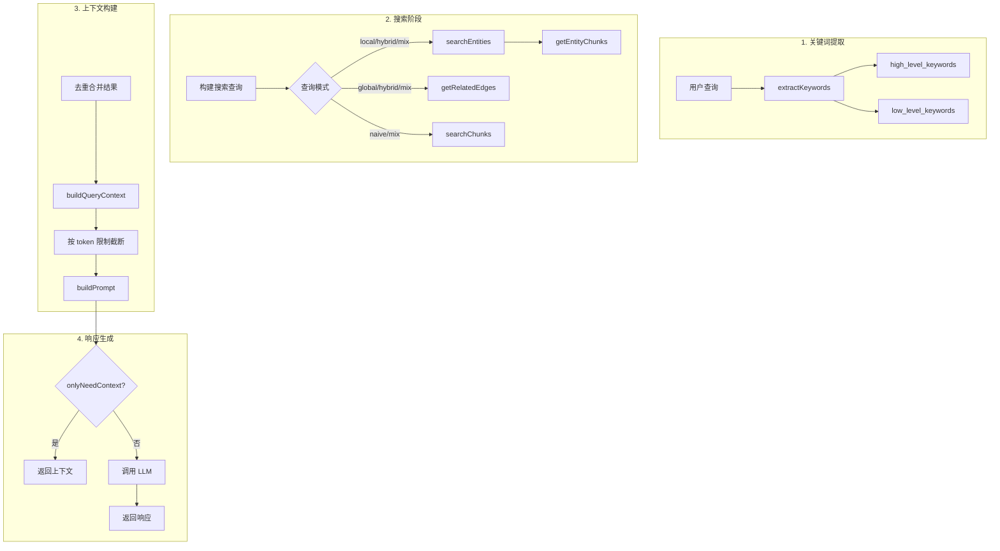

# operate/query.ts - 查询管道

## 概述

实现 LightRAG 的 4 阶段查询管道：搜索 → 截断 → 合并 → 上下文构建 → LLM 响应。

## 查询模式

| 模式     | 知识图谱实体 | 知识图谱关系 | 向量块搜索    | 说明         |
| -------- | ------------ | ------------ | ------------- | ------------ |
| `local`  | ✅           | ❌           | ✅ (通过实体) | 专注具体实体 |
| `global` | ✅           | ✅           | ❌            | 专注关系网络 |
| `hybrid` | ✅           | ✅           | ✅ (通过实体) | 综合模式     |
| `naive`  | ❌           | ❌           | ✅ (直接)     | 传统 RAG     |
| `mix`    | ✅           | ✅           | ✅ (两种)     | 所有来源     |
| `bypass` | ❌           | ❌           | ❌            | 直接返回失败 |

## 核心函数

### kgQuery

```typescript
async function kgQuery(
  query: string,
  graphStorage: BaseGraphStorage,
  entitiesVdb: BaseVectorStorage,
  relationsVdb: BaseVectorStorage,
  chunksKv: BaseKVStorage,
  llmFunc: LLMFunction,
  param: QueryParam,
  chunksVdb?: BaseVectorStorage
): Promise<QueryResult>;
```

**返回值**:

```typescript
interface QueryResult {
  response: string; // LLM 生成的回答
  context?: string; // 使用的上下文
  rawData?: QueryRawData; // 原始数据（调试用）
}
```

## 查询流程



## 阶段详解

### 阶段 1：关键词提取

```typescript
async function extractKeywords(
  query: string,
  llmFunc: LLMFunction,
  language?: string
): Promise<{ highLevel: string[]; lowLevel: string[] }>;
```

**示例**:

- 查询: "国际贸易如何影响经济稳定？"
- 高级: ["国际贸易", "经济稳定", "经济影响"]
- 低级: ["贸易协定", "关税", "汇率", "进口", "出口"]

### 阶段 2：搜索

#### searchEntities

```typescript
async function searchEntities(
  query: string,
  entitiesVdb: BaseVectorStorage,
  graphStorage: BaseGraphStorage,
  topK: number
): Promise<Array<GraphNode & { entityName: string; rank: number }>>;
```

1. 向量搜索相似实体
2. 从图存储获取节点详情
3. 按度数排序（更重要的实体排序更高）

#### getRelatedEdges

```typescript
async function getRelatedEdges(
  entities: Array<{ entityName: string }>,
  graphStorage: BaseGraphStorage
): Promise<ExtendedEdge[]>;
```

1. 获取实体的所有相连边
2. 去重（无向图）
3. 按度数和权重排序

#### getEntityChunks

从实体的 `source_id` 字段获取相关文本块。

### 阶段 3：上下文构建

#### buildQueryContext

```typescript
function buildQueryContext(
  entities: [...],
  relations: [...],
  chunks: [...],
  param: QueryParam
): QueryContext
```

按 token 限制截断：

- 实体: `maxEntityTokens` (默认 6000)
- 关系: `maxRelationTokens` (默认 8000)
- 块: 剩余空间

#### buildPrompt

组装最终的 LLM 提示词，包含：

- 知识图谱实体（JSON）
- 知识图谱关系（JSON）
- 文档块（带引用 ID）
- 参考列表

### 阶段 4：响应生成

调用 LLM 生成最终回答，包含：

- Markdown 格式
- 引用标注
- 与查询同语言

## 使用示例

```typescript
import { kgQuery } from "./operate/query.js";

const result = await kgQuery(
  "谁发明了相对论？",
  graphStorage,
  entitiesVdb,
  relationsVdb,
  chunksKv,
  llmFunc,
  {
    mode: "hybrid",
    topK: 20,
    conversationHistory: [
      { role: "user", content: "你好" },
      { role: "assistant", content: "你好！有什么可以帮你的？" },
    ],
  },
  chunksVdb
);

console.log(result.response);
```

## QueryParam 详解

```typescript
interface QueryParam {
  mode: QueryMode; // 查询模式
  topK?: number; // 检索数量
  maxEntityTokens?: number; // 实体上下文限制
  maxRelationTokens?: number; // 关系上下文限制
  maxTotalTokens?: number; // 总 token 限制
  onlyNeedContext?: boolean; // 只返回上下文
  responseType?: string; // 响应格式
  userPrompt?: string; // 自定义指令
  conversationHistory?: ChatMessage[]; // 历史对话
  hlKeywords?: string[]; // 预设高级关键词
  llKeywords?: string[]; // 预设低级关键词
}
```

## 特殊模式

### onlyNeedContext

```typescript
const result = await kgQuery(query, ..., {
  mode: 'hybrid',
  onlyNeedContext: true,
});
// result.response = ''
// result.context = '完整的 LLM 提示词'
// result.rawData = { entities, relations, chunks, ... }
```

### bypass

立即返回失败响应，不进行任何搜索。
