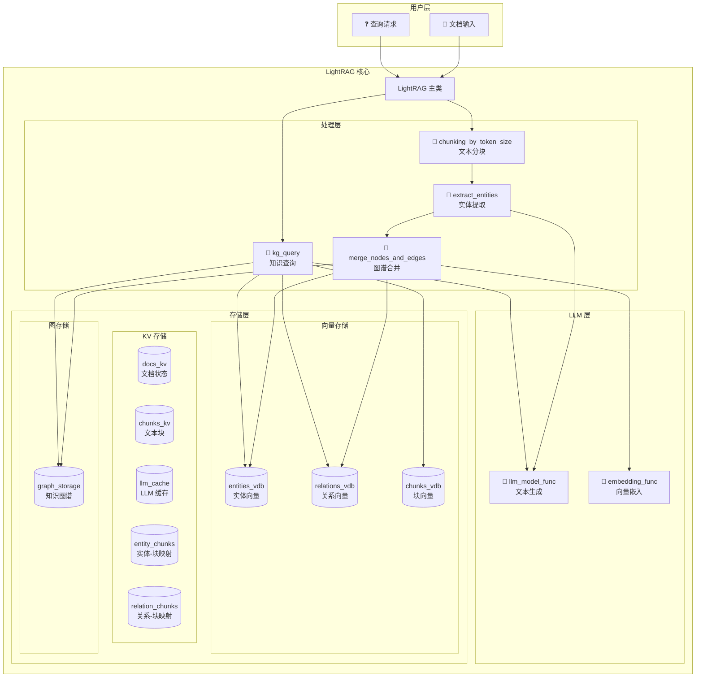
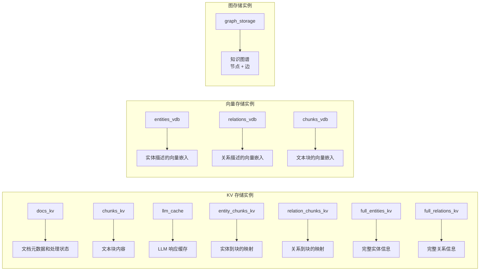
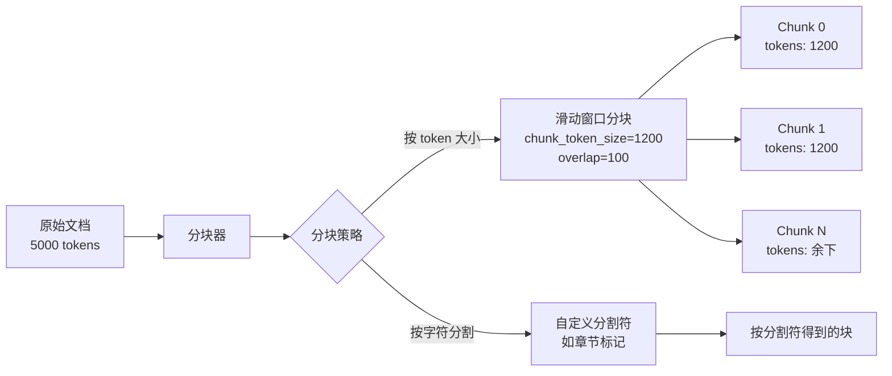
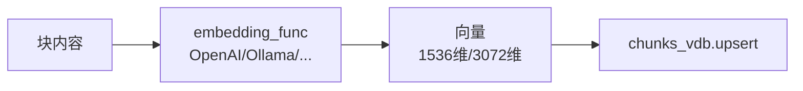
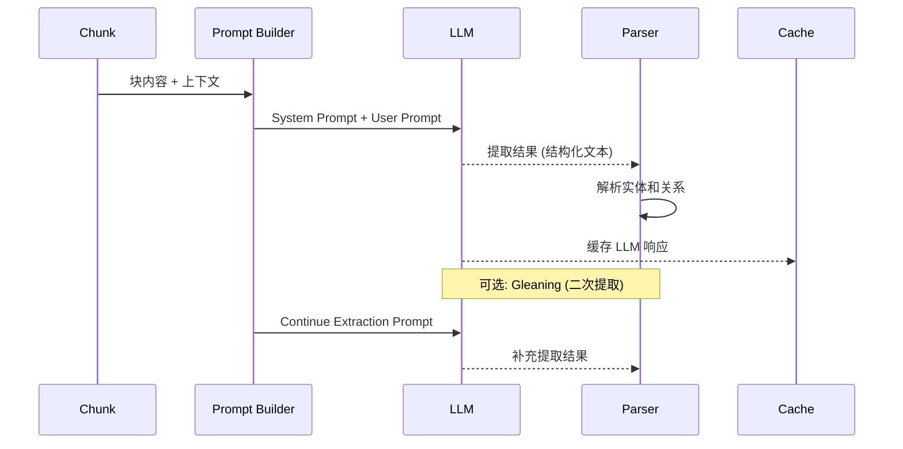
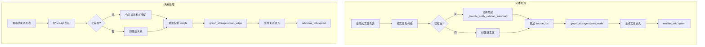
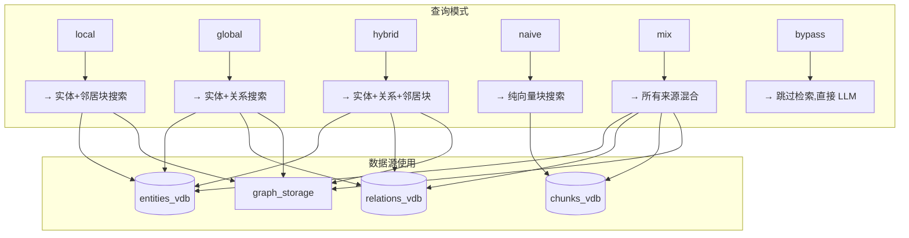
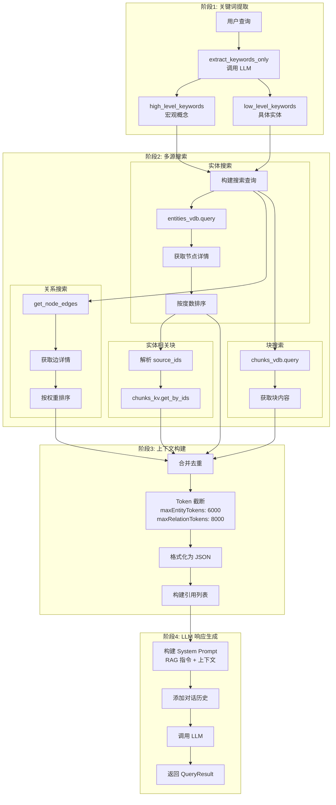
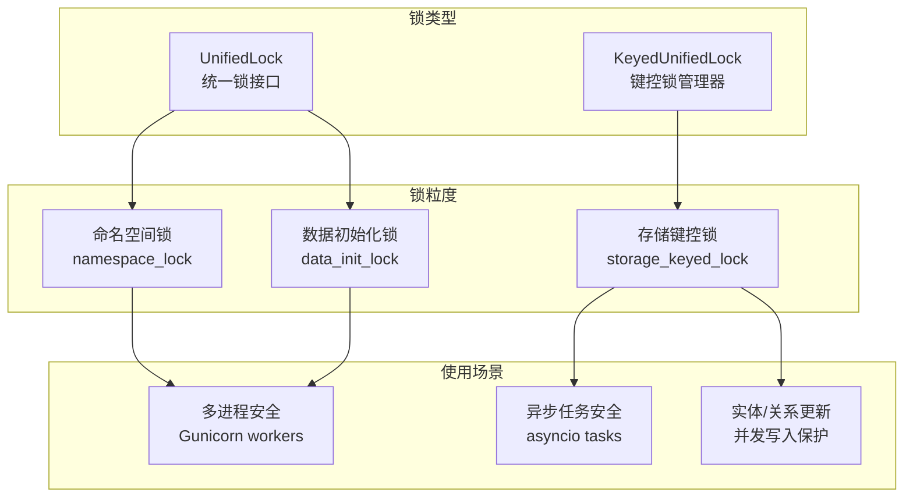

# LightRAG 项目代码全面分析

本文档对 LightRAG (Python) 项目进行全面深入的代码分析，详细解释各模块的功能、数据流向、以及存储机制。

---

## 1. 项目整体架构

### 1.1 目录结构

```
lightrag/
├── __init__.py           # 包入口
├── lightrag.py          # 主类 LightRAG (4059 行)
├── operate.py           # 核心操作逻辑 (5003 行)
├── base.py              # 抽象存储接口 (908 行)
├── prompt.py            # LLM 提示词模板
├── constants.py         # 全局常量配置
├── utils.py             # 工具函数 (3353 行)
├── utils_graph.py       # 图相关工具
├── types.py             # 类型定义
├── exceptions.py        # 自定义异常
├── namespace.py         # 命名空间管理
├── rerank.py            # 重排序功能
├── kg/                  # 知识图谱存储实现
│   ├── __init__.py      # 存储注册表
│   ├── shared_storage.py # 共享存储管理 (锁、命名空间)
│   ├── json_kv_impl.py  # JSON KV 存储
│   ├── nano_vector_db_impl.py  # NanoVectorDB 向量存储
│   ├── networkx_impl.py # NetworkX 图存储
│   ├── neo4j_impl.py    # Neo4j 图存储
│   ├── milvus_impl.py   # Milvus 向量存储
│   ├── postgres_impl.py # PostgreSQL 存储
│   ├── mongo_impl.py    # MongoDB 存储
│   ├── redis_impl.py    # Redis 存储
│   ├── qdrant_impl.py   # Qdrant 向量存储
│   └── ...
├── llm/                 # LLM 模型接口
│   ├── openai.py
│   ├── anthropic.py
│   ├── gemini.py
│   ├── ollama.py
│   └── ...
└── api/                 # REST API 服务
    └── lightrag_server.py
```

### 1.2 核心架构图



---

## 2. 存储类型详解

LightRAG 使用四种类型的存储系统，每种都有多个实现选项：

### 2.1 存储类型注册表

```python
# 来自 kg/__init__.py

STORAGE_IMPLEMENTATIONS = {
    "KV_STORAGE": {
        "implementations": [
            "JsonKVStorage",      # 基于 JSON 文件
            "RedisKVStorage",     # Redis
            "PGKVStorage",        # PostgreSQL
            "MongoKVStorage",     # MongoDB
        ],
        "required_methods": ["get_by_id", "upsert"],
    },
    "GRAPH_STORAGE": {
        "implementations": [
            "NetworkXStorage",    # 内存 NetworkX 图
            "Neo4JStorage",       # Neo4j 图数据库
            "PGGraphStorage",     # PostgreSQL 图
            "MongoGraphStorage",  # MongoDB 图
            "MemgraphStorage",    # Memgraph
        ],
        "required_methods": ["upsert_node", "upsert_edge"],
    },
    "VECTOR_STORAGE": {
        "implementations": [
            "NanoVectorDBStorage", # 内存 NanoVectorDB
            "MilvusVectorDBStorage", # Milvus
            "PGVectorStorage",    # PostgreSQL + pgvector
            "FaissVectorDBStorage", # FAISS
            "QdrantVectorDBStorage", # Qdrant
            "MongoVectorDBStorage", # MongoDB Atlas
        ],
        "required_methods": ["query", "upsert"],
    },
    "DOC_STATUS_STORAGE": {
        "implementations": [
            "JsonDocStatusStorage",
            "RedisDocStatusStorage",
            "PGDocStatusStorage",
            "MongoDocStatusStorage",
        ],
        "required_methods": ["get_docs_by_status"],
    },
}
```

### 2.2 存储实例一览



### 2.3 数据持久化结构

使用 JSON 存储时，数据文件结构如下：

```
{working_dir}/{namespace}/
├── doc_status.json       # 文档处理状态 (DocStatusStorage)
├── chunks.json           # 文本块内容 (KV)
├── llm_cache.json        # LLM 响应缓存 (KV)
├── entity_chunks.json    # 实体-块映射 (KV)
├── relation_chunks.json  # 关系-块映射 (KV)
├── full_entities.json    # 完整实体数据 (KV)
├── full_relations.json   # 完整关系数据 (KV)
├── entities_vdb.json     # 实体向量数据
├── relations_vdb.json    # 关系向量数据
├── chunks_vdb.json       # 块向量数据
└── graph.graphml         # NetworkX 图谱 (GraphML 格式)
```

---

## 3. Data Ingestion (数据摄入) 流程详解

### 3.1 高层流程图

```mermaid
flowchart TD
    subgraph 阶段1: 文档预处理
        A[📄 输入文档] --> B[生成文档 ID<br/>compute_mdhash_id]
        B --> C{文档已存在?}
        C -->|是| D[检查状态]
        D -->|processed| E[跳过]
        D -->|其他| F[重新处理]
        C -->|否| G[创建新文档记录]
        F --> H[更新状态为<br/>processing]
        G --> H
    end

    subgraph 阶段2: 文本分块
        H --> I[chunking_by_token_size]
        I --> J[生成块 ID<br/>chunk-{hash}]
        J --> K[存储到 chunks_kv]
    end

    subgraph 阶段3: 向量嵌入
        K --> L[生成块嵌入<br/>embedding_func]
        L --> M[存储到 chunks_vdb]
    end

    subgraph 阶段4: 实体关系提取
        M --> N[extract_entities<br/>调用 LLM]
        N --> O[解析实体和关系]
        O --> P[缓存 LLM 响应]
    end

    subgraph 阶段5: 知识图谱构建
        P --> Q[merge_nodes_and_edges]
        Q --> R[合并实体描述]
        R --> S[更新 graph_storage 节点]
        S --> T[生成实体嵌入]
        T --> U[更新 entities_vdb]
        Q --> V[合并关系描述]
        V --> W[更新 graph_storage 边]
        W --> X[生成关系嵌入]
        X --> Y[更新 relations_vdb]
    end

    subgraph 阶段6: 完成
        U --> Z[更新状态为<br/>processed]
        Y --> Z
        Z --> AA[index_done_callback<br/>持久化]
        AA --> AB[✅ 完成]
    end
```

### 3.2 阶段详解

#### 阶段 1: 文档预处理

**核心代码位置**: `lightrag.py` - `apipeline_enqueue_documents()`

```python
# 生成文档唯一 ID
doc_id = compute_mdhash_id(content.strip(), prefix="doc-")

# 检查文档状态
status = await self.doc_status_storage.get_status_by_id(doc_id)

# 状态类型
class DocStatus(Enum):
    PENDING = "pending"       # 等待处理
    PROCESSING = "processing" # 处理中
    PROCESSED = "processed"   # 已完成
    FAILED = "failed"         # 处理失败
```

**存储写入**:

- `doc_status` → 文档 ID、状态、文件路径、时间戳

#### 阶段 2: 文本分块

**核心代码位置**: `operate.py` - `chunking_by_token_size()`



**分块参数**:

- `chunk_token_size`: 每块最大 token 数 (默认 1200)
- `chunk_overlap_token_size`: 块间重叠 token 数 (默认 100)
- `split_by_character`: 自定义分割字符
- `split_by_character_only`: 是否仅按字符分割

**存储写入**:

- `chunks_kv` → chunk_id, content, tokens, full_doc_id, chunk_order_index, file_path

#### 阶段 3: 向量嵌入



**存储写入**:

- `chunks_vdb` → chunk_id, vector, metadata

#### 阶段 4: 实体关系提取

**核心代码位置**: `operate.py` - `extract_entities()`



**LLM 提取格式**:

```
# 实体格式
entity<|#|>实体名称<|#|>实体类型<|#|>实体描述

# 关系格式
relation<|#|>源实体<|#|>目标实体<|#|>关键词<|#|>关系描述

# 完成标记
<|COMPLETE|>
```

**存储写入**:

- `llm_cache` → cache_key, response, create_time, cache_type

#### 阶段 5: 知识图谱构建

**核心代码位置**: `operate.py` - `merge_nodes_and_edges()`



**描述合并策略**:

```python
# 来自 _handle_entity_relation_summary()

1. 如果描述数 < force_llm_summary_on_merge 且 总 token < summary_max_tokens:
   → 直接拼接描述 (无需 LLM)

2. 否则使用 Map-Reduce 策略:
   → 将描述分组，每组调用 LLM 摘要
   → 递归处理直到满足条件
```

**存储写入**:

- `graph_storage` (节点) → entity_name, entity_type, description, source_id, file_path
- `graph_storage` (边) → src_id, tgt_id, weight, description, keywords, source_id
- `entities_vdb` → entity_name, vector, metadata
- `relations_vdb` → relation_key, vector, metadata
- `entity_chunks_kv` → entity_name → [chunk_ids]
- `relation_chunks_kv` → relation_key → [chunk_ids]

---

## 4. Query (查询) 流程详解

### 4.1 查询模式



### 4.2 完整查询流程



### 4.3 查询参数详解

```python
@dataclass
class QueryParam:
    mode: Literal["local", "global", "hybrid", "naive", "mix", "bypass"] = "mix"
    only_need_context: bool = False        # 仅返回上下文
    only_need_prompt: bool = False         # 仅返回 prompt
    stream: bool = False                   # 流式输出
    top_k: int = 40                        # 检索数量
    chunk_top_k: int = 20                  # 块检索数量
    max_entity_tokens: int = 6000          # 实体最大 token
    max_relation_tokens: int = 8000        # 关系最大 token
    max_total_tokens: int = 30000          # 总最大 token
    hl_keywords: list[str] = []            # 预定义高层关键词
    ll_keywords: list[str] = []            # 预定义低层关键词
    conversation_history: list = []        # 对话历史
    enable_rerank: bool = True             # 启用重排序
```

---

## 5. 核心数据结构

### 5.1 文档状态 (DocProcessingStatus)

```python
{
    "id": "doc-a1b2c3...",           # 文档唯一 ID
    "content_md5": "...",            # 内容 MD5
    "status": "processed",           # pending/processing/processed/failed
    "created_at": "2024-01-15T...",  # 创建时间
    "updated_at": "2024-01-15T...",  # 更新时间
    "file_path": "example.txt",      # 文件路径
    "error_msg": null,               # 错误信息
    "chunk_count": 5,                # 块数量
}
```

### 5.2 文本块 (TextChunkSchema)

```python
{
    "id": "chunk-a1b2c3...",          # 块唯一 ID
    "tokens": 1150,                   # token 数量
    "content": "块的文本内容...",      # 文本内容
    "full_doc_id": "doc-...",         # 所属文档 ID
    "chunk_order_index": 0,           # 块顺序索引
    "file_path": "example.txt",       # 来源文件
    "llm_cache_list": ["cache-..."]   # 关联的缓存 key
}
```

### 5.3 图节点 (Entity)

```python
{
    "entity_name": "爱因斯坦",         # 实体名称 (作为节点 ID)
    "entity_type": "person",          # 实体类型
    "description": "德国物理学家...",  # 描述 (可合并)
    "source_id": "chunk-a<SEP>chunk-b", # 来源块 IDs
    "file_path": "physics.txt",       # 来源文件
}
```

### 5.4 图边 (Relation)

```python
{
    "src_id": "爱因斯坦",             # 源实体
    "tgt_id": "相对论",              # 目标实体
    "weight": 2.5,                   # 权重 (累加)
    "description": "提出了...",       # 关系描述
    "keywords": "创立,发展",          # 关键词
    "source_id": "chunk-a<SEP>chunk-b", # 来源块 IDs
    "file_path": "physics.txt",       # 来源文件
}
```

### 5.5 向量存储数据

```python
# entities_vdb / relations_vdb / chunks_vdb
{
    "id": "entity_name 或 chunk_id",
    "vector": [0.1, 0.2, ...],        # 嵌入向量
    "metadata": {
        "entity_name": "...",
        "description": "...",
        # 其他元数据
    }
}
```

---

## 6. LLM Prompt 模板

### 6.1 实体提取 Prompt

```
---Role---
You are a Knowledge Graph Specialist responsible for extracting
entities and relationships from the input text.

---Instructions---
1. Entity Extraction & Output:
   - Identification: Identify clearly defined and meaningful entities
   - Entity Details: entity_name, entity_type, entity_description
   - Format: entity<|#|>name<|#|>type<|#|>description

2. Relationship Extraction & Output:
   - Identification: Identify direct, clearly stated relationships
   - Relationship Details: source, target, keywords, description
   - Format: relation<|#|>source<|#|>target<|#|>keywords<|#|>description

3. Completion: Output <|COMPLETE|> as the final line
```

### 6.2 关键词提取 Prompt

```
Given the query, extract:
- High-level keywords: Broad concepts for understanding the query scope
- Low-level keywords: Specific entities, names, or concrete terms

Output format:
{
    "high_level_keywords": [...],
    "low_level_keywords": [...]
}
```

### 6.3 RAG 响应生成 Prompt

```
---Role---
You are a helpful assistant responding to user queries using
the provided Knowledge Graph and document chunks.

---Data Sources---
1. Knowledge Graph Entities: [...]
2. Knowledge Graph Relations: [...]
3. Document Chunks: [...]

---Query---
{user_query}

---Instructions---
- Use the provided data to answer accurately
- Cite sources using reference IDs
- If information is insufficient, acknowledge limitations
```

---

## 7. 关键配置常量

```python
# 来自 constants.py

# 分块配置
DEFAULT_CHUNK_TOKEN_SIZE = 1200
DEFAULT_CHUNK_OVERLAP = 100

# 提取配置
DEFAULT_MAX_GLEANING = 1              # 二次提取次数
DEFAULT_ENTITY_NAME_MAX_LENGTH = 256  # 实体名最大长度
DEFAULT_ENTITY_TYPES = [
    "Person", "Creature", "Organization", "Location",
    "Event", "Concept", "Method", "Content", "Data",
    "Artifact", "NaturalObject"
]

# 描述摘要配置
DEFAULT_FORCE_LLM_SUMMARY_ON_MERGE = 8   # 触发 LLM 摘要的描述数
DEFAULT_SUMMARY_MAX_TOKENS = 1200        # 触发摘要的最大 token
DEFAULT_SUMMARY_LENGTH_RECOMMENDED = 600 # 推荐摘要长度
DEFAULT_SUMMARY_CONTEXT_SIZE = 12000     # 摘要上下文最大 token

# 查询配置
DEFAULT_TOP_K = 40
DEFAULT_CHUNK_TOP_K = 20
DEFAULT_MAX_ENTITY_TOKENS = 6000
DEFAULT_MAX_RELATION_TOKENS = 8000
DEFAULT_MAX_TOTAL_TOKENS = 30000
DEFAULT_COSINE_THRESHOLD = 0.2

# Source ID 管理
DEFAULT_MAX_SOURCE_IDS_PER_ENTITY = 300
DEFAULT_MAX_SOURCE_IDS_PER_RELATION = 300
GRAPH_FIELD_SEP = "<SEP>"                # source_id 分隔符

# 异步配置
DEFAULT_MAX_ASYNC = 4
DEFAULT_MAX_PARALLEL_INSERT = 2
DEFAULT_EMBEDDING_FUNC_MAX_ASYNC = 8
DEFAULT_EMBEDDING_BATCH_NUM = 10

# 超时配置
DEFAULT_LLM_TIMEOUT = 180
DEFAULT_EMBEDDING_TIMEOUT = 30
```

---

## 8. 存储接口抽象

### 8.1 BaseKVStorage

```python
class BaseKVStorage(ABC):
    """键值存储抽象基类"""

    @abstractmethod
    async def get_by_id(self, id: str) -> dict | None:
        """根据 ID 获取值"""

    @abstractmethod
    async def get_by_ids(self, ids: list[str]) -> list[dict]:
        """批量获取"""

    @abstractmethod
    async def filter_keys(self, keys: set[str]) -> set[str]:
        """过滤不存在的 keys"""

    @abstractmethod
    async def upsert(self, data: dict[str, dict]) -> None:
        """插入或更新"""

    @abstractmethod
    async def delete(self, ids: list[str]) -> None:
        """删除"""
```

### 8.2 BaseVectorStorage

```python
class BaseVectorStorage(ABC):
    """向量存储抽象基类"""

    embedding_func: EmbeddingFunc
    cosine_better_than_threshold: float = 0.2

    @abstractmethod
    async def query(
        self, query: str, top_k: int,
        query_embedding: list[float] = None
    ) -> list[dict]:
        """语义查询"""

    @abstractmethod
    async def upsert(self, data: dict[str, dict]) -> None:
        """插入或更新向量"""

    @abstractmethod
    async def delete(self, ids: list[str]) -> None:
        """删除向量"""
```

### 8.3 BaseGraphStorage

```python
class BaseGraphStorage(ABC):
    """图存储抽象基类"""

    @abstractmethod
    async def has_node(self, node_id: str) -> bool:
        """检查节点是否存在"""

    @abstractmethod
    async def has_edge(self, src: str, tgt: str) -> bool:
        """检查边是否存在"""

    @abstractmethod
    async def get_node(self, node_id: str) -> dict | None:
        """获取节点"""

    @abstractmethod
    async def get_edge(self, src: str, tgt: str) -> dict | None:
        """获取边"""

    @abstractmethod
    async def get_node_edges(self, node_id: str) -> list[tuple]:
        """获取节点的所有边"""

    @abstractmethod
    async def upsert_node(self, node_id: str, node_data: dict) -> None:
        """插入或更新节点"""

    @abstractmethod
    async def upsert_edge(
        self, src: str, tgt: str, edge_data: dict
    ) -> None:
        """插入或更新边"""

    @abstractmethod
    async def node_degree(self, node_id: str) -> int:
        """获取节点度数"""
```

---

## 9. 并发和锁机制

### 9.1 共享存储锁



### 9.2 并发控制

```python
# 来自 operate.py

# 实体提取并发
chunk_max_async = global_config.get("llm_model_max_async", 4)
semaphore = asyncio.Semaphore(chunk_max_async)

# 图操作并发
graph_max_async = global_config.get("llm_model_max_async", 4) * 2

# 实体/关系更新时使用键控锁
async with get_storage_keyed_lock(
    [entity_name],
    namespace="GraphDB",
    enable_logging=False
):
    await _merge_nodes_then_upsert(...)
```

---

## 10. 完整使用示例

```python
from lightrag import LightRAG

async def main():
    # 1. 初始化
    rag = LightRAG(
        working_dir="./my_rag_storage",
        namespace="demo",
        kv_storage="JsonKVStorage",
        vector_storage="NanoVectorDBStorage",
        graph_storage="NetworkXStorage",
        llm_model_func=my_llm_func,
        embedding_func=my_embedding_func,
        entity_types=["Person", "Organization", "Event"],
        language="Chinese",
    )
    await rag.initialize_storages()

    # 2. 插入文档
    await rag.ainsert("""
        爱因斯坦于1905年发表了狭义相对论。
        这一理论彻底改变了物理学的基础。
        1921年，他因光电效应获得诺贝尔物理学奖。
    """, file_paths="physics.txt")

    # 3. 查询
    result = await rag.aquery(
        "爱因斯坦获得了什么奖项？",
        param=QueryParam(mode="hybrid", top_k=10)
    )
    print(result)

    # 4. 获取知识图谱
    kg = await rag.get_knowledge_graph("爱因斯坦", max_depth=2)
    print(f"节点: {len(kg.nodes)}, 边: {len(kg.edges)}")

    # 5. 清理
    await rag.finalize_storages()

asyncio.run(main())
```

---

## 11. 总结

LightRAG 是一个功能完备的 RAG 框架，其核心特点包括：

1. **模块化存储**: 支持多种存储后端 (JSON/Redis/PostgreSQL/MongoDB/Neo4j 等)
2. **知识图谱增强**: 不仅使用向量检索，还构建知识图谱提升检索质量
3. **智能描述合并**: 使用 Map-Reduce 策略处理重复实体/关系的描述
4. **灵活查询模式**: 支持 local/global/hybrid/naive/mix 多种查询策略
5. **企业级特性**: 支持多进程、异步并发、缓存、重排序等
6. **可扩展架构**: 清晰的抽象接口便于添加新的存储实现
