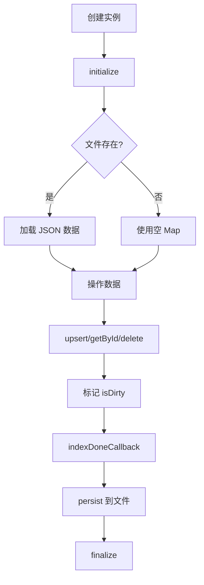

# storage/json-kv.ts - JSON 键值存储

## 概述

基于 JSON 文件的键值存储实现，提供数据持久化功能。

## 类定义

```typescript
class JsonKVStorage<T = Record<string, unknown>> implements BaseKVStorage<T>
```

## 构造函数

```typescript
constructor(config: StorageConfig & { storageName: string })
```

**参数**:

- `workingDir`: 工作目录
- `namespace`: 命名空间（数据隔离）
- `storageName`: 存储名称（决定文件名）

**文件路径**: `{workingDir}/{namespace}/{storageName}.json`

## 工作流程



## 核心方法

### initialize()

```typescript
async initialize(): Promise<void>
```

初始化存储：

1. 确保目录存在
2. 如果文件存在，加载 JSON 数据到内存

### getById(id)

```typescript
async getById(id: string): Promise<T | null>
```

从内存 Map 中获取单个值。

### getByIds(ids)

```typescript
async getByIds(ids: string[]): Promise<T[]>
```

批量获取多个值。

### filterKeys(keys)

```typescript
async filterKeys(keys: Set<string>): Promise<Set<string>>
```

返回在存储中不存在的键集合（用于增量处理）。

### upsert(data)

```typescript
async upsert(data: Record<string, T>): Promise<void>
```

插入或更新多个键值对，标记 `isDirty = true`。

### delete(ids)

```typescript
async delete(ids: string[]): Promise<void>
```

删除指定 ID 的数据。

### indexDoneCallback()

```typescript
async indexDoneCallback(): Promise<void>
```

如果有更改，将数据持久化到 JSON 文件。

### drop()

```typescript
async drop(): Promise<{ status: string; message: string }>
```

清空所有数据并持久化。

## 内部机制

### 数据结构

```typescript
private data: Map<string, T> = new Map();  // 内存数据
private isDirty: boolean = false;           // 是否有未保存更改
private initialized: boolean = false;       // 是否已初始化
```

### 持久化

```typescript
private async persist(): Promise<void> {
  const obj: Record<string, T> = {};
  for (const [key, value] of this.data.entries()) {
    obj[key] = value;
  }
  await writeJson(this.filePath, obj);
  this.isDirty = false;
}
```

## 使用示例

```typescript
import { JsonKVStorage } from "./storage/json-kv.js";
import type { DocumentStatus } from "./types.js";

// 创建存储
const docsKv = new JsonKVStorage<DocumentStatus>({
  workingDir: "./data",
  namespace: "my-project",
  storageName: "docs",
});

// 初始化
await docsKv.initialize();

// 存储数据
await docsKv.upsert({
  "doc-123": {
    contentSummary: "Hello world...",
    status: "processed",
    // ...
  },
});

// 读取数据
const doc = await docsKv.getById("doc-123");

// 持久化
await docsKv.indexDoneCallback();

// 清理
await docsKv.finalize();
```

## 文件格式

存储的 JSON 文件结构：

```json
{
  "doc-abc123": {
    "contentSummary": "...",
    "status": "processed"
  },
  "doc-def456": {
    "contentSummary": "...",
    "status": "pending"
  }
}
```
