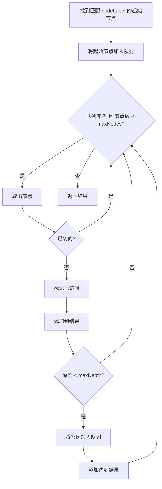
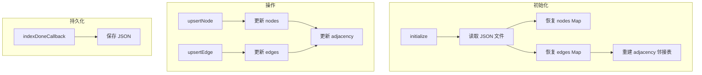

# storage/memory-graph.ts - 内存图存储

## 概述

基于内存的知识图谱存储实现，使用邻接表表示图结构，支持 BFS 遍历和 JSON 持久化。

## 类定义

```typescript
class MemoryGraphStorage implements BaseGraphStorage
```

## 数据结构

```typescript
private nodes: Map<string, GraphNode> = new Map();      // 节点数据
private edges: Map<string, GraphEdge> = new Map();      // 边数据 (key: "src||tgt")
private adjacency: Map<string, Set<string>> = new Map(); // 邻接表
```

### 边的键格式

边使用排序后的节点 ID 作为键（实现无向图）：

```typescript
private edgeKey(src: string, tgt: string): string {
  const sorted = [src, tgt].sort();
  return `${sorted[0]}||${sorted[1]}`;
}
```

## 核心方法

### 1. 节点操作

#### upsertNode(nodeId, nodeData)

```typescript
async upsertNode(nodeId: string, nodeData: GraphNode): Promise<void>
```

添加或更新节点。

**节点数据示例**:

```typescript
await graph.upsertNode("Albert Einstein", {
  entity_type: "person",
  description: "German theoretical physicist",
  source_id: "chunk-abc<SEP>chunk-def",
});
```

#### getNode(nodeId)

```typescript
async getNode(nodeId: string): Promise<GraphNode | null>
```

#### nodeDegree(nodeId)

```typescript
async nodeDegree(nodeId: string): Promise<number>
```

返回节点的连接数（度）。

### 2. 边操作

#### upsertEdge(srcId, tgtId, edgeData)

```typescript
async upsertEdge(
  sourceNodeId: string,
  targetNodeId: string,
  edgeData: GraphEdge
): Promise<void>
```

**边数据示例**:

```typescript
await graph.upsertEdge("Einstein", "Physics", {
  weight: 1.5,
  description: "Einstein contributed to theoretical physics",
  keywords: "contribution, research",
  source_id: "chunk-abc",
});
```

#### getEdge(srcId, tgtId)

```typescript
async getEdge(srcId: string, tgtId: string): Promise<GraphEdge | null>
```

#### getNodeEdges(nodeId)

```typescript
async getNodeEdges(nodeId: string): Promise<Array<[string, string]> | null>
```

返回与节点相连的所有边。

### 3. 批量操作

```typescript
// 批量获取节点
async getNodesBatch(nodeIds: string[]): Promise<Map<string, GraphNode>>

// 批量获取度数
async nodeDegreesBatch(nodeIds: string[]): Promise<Map<string, number>>

// 批量获取边
async getEdgesBatch(pairs: Array<{src, tgt}>): Promise<Map<string, GraphEdge>>
```

### 4. 知识图谱遍历

#### getKnowledgeGraph(nodeLabel, maxDepth, maxNodes)

```typescript
async getKnowledgeGraph(
  nodeLabel: string,      // 起始节点标签（"*" = 所有）
  maxDepth: number = 3,   // 最大遍历深度
  maxNodes: number = 1000 // 最大节点数
): Promise<KnowledgeGraph>
```

**BFS 遍历算法**:



**返回结构**:

```typescript
{
  nodes: [
    { id: 'Einstein', label: 'person', description: '...', degree: 5 },
    // ...
  ],
  edges: [
    { source: 'Einstein', target: 'Physics', weight: 1.5, ... },
    // ...
  ],
  isTruncated: false  // 如果达到 maxNodes 限制则为 true
}
```

## 工作流程



## 使用示例

```typescript
import { MemoryGraphStorage } from "./storage/memory-graph.js";

const graph = new MemoryGraphStorage({
  workingDir: "./data",
  namespace: "my-project",
  storageName: "graph",
});

await graph.initialize();

// 添加节点
await graph.upsertNode("Einstein", {
  entity_type: "person",
  description: "Theoretical physicist",
});
await graph.upsertNode("Relativity", {
  entity_type: "concept",
  description: "Theory of spacetime",
});

// 添加边
await graph.upsertEdge("Einstein", "Relativity", {
  weight: 2,
  keywords: "developed, discovered",
  description: "Einstein developed the theory of relativity",
});

// 获取知识图谱
const kg = await graph.getKnowledgeGraph("Einstein", 2, 100);
console.log(`Nodes: ${kg.nodes.length}, Edges: ${kg.edges.length}`);

// 持久化
await graph.indexDoneCallback();
```

## JSON 存储格式

```json
{
  "nodes": {
    "Einstein": {
      "entity_type": "person",
      "description": "Theoretical physicist",
      "source_id": "chunk-abc"
    }
  },
  "edges": {
    "Einstein||Relativity": {
      "weight": 2,
      "description": "Einstein developed relativity",
      "keywords": "developed"
    }
  }
}
```
