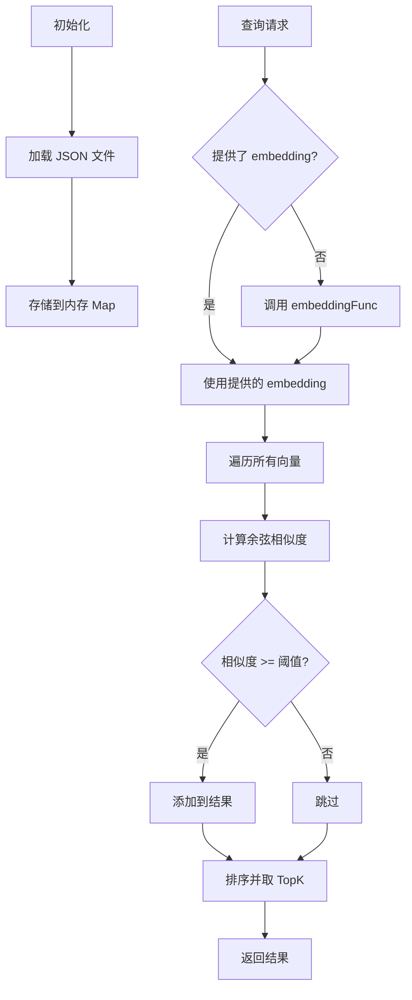

# storage/memory-vector.ts - 内存向量存储

## 概述

基于内存的向量存储实现，使用余弦相似度进行相似度搜索，支持 JSON 文件持久化。

## 类定义

```typescript
class MemoryVectorStorage implements BaseVectorStorage
```

## 构造函数

```typescript
constructor(config: StorageConfig & {
  storageName: string;
  cosineThreshold?: number;  // 默认 0.2
})
```

## 核心功能

### 1. 相似度搜索

#### query(query, topK, queryEmbedding?)

```typescript
async query(
  query: string,
  topK: number,
  queryEmbedding?: number[]
): Promise<VectorQueryResult[]>
```

**工作流程**:

1. 如果未提供 `queryEmbedding`，调用 `embeddingFunc` 生成
2. 遍历所有存储的向量
3. 计算余弦相似度
4. 过滤低于阈值的结果
5. 按相似度降序排序
6. 返回 top-K 结果

**余弦相似度公式**:
$$\text{similarity} = \frac{\vec{a} \cdot \vec{b}}{|\vec{a}| \times |\vec{b}|}$$

### 2. 数据操作

#### upsert(data)

```typescript
async upsert(data: Record<string, VectorData>): Promise<void>
```

插入或更新向量数据。

**VectorData 结构**:

```typescript
{
  id: string;
  embedding: number[];
  content?: string;
  metadata?: {
    entity_name?: string;
    entity_type?: string;
    file_path?: string;
    // ...
  }
}
```

#### deleteEntity(entityName)

```typescript
async deleteEntity(entityName: string): Promise<void>
```

根据 `metadata.entity_name` 删除实体。

#### deleteEntityRelation(entityName)

```typescript
async deleteEntityRelation(entityName: string): Promise<void>
```

删除源或目标为指定实体的所有关系。

### 3. 持久化

数据自动保存为 JSON 文件：

```
{workingDir}/{namespace}/{storageName}.json
```

## 工作流程



## 使用示例

```typescript
import { MemoryVectorStorage } from './storage/memory-vector.js';
import { createOpenAIEmbed } from './llm/openai.js';

// 创建存储
const vectorDb = new MemoryVectorStorage({
  workingDir: './data',
  namespace: 'my-project',
  storageName: 'entities_vdb',
  embeddingFunc: createOpenAIEmbed(),
  cosineThreshold: 0.3,
});

await vectorDb.initialize();

// 插入向量
await vectorDb.upsert({
  'entity-einstein': {
    id: 'entity-einstein',
    embedding: [0.1, 0.2, ...], // 1536 维
    content: 'Albert Einstein was a theoretical physicist...',
    metadata: {
      entity_name: 'Albert Einstein',
      entity_type: 'Person',
    },
  },
});

// 查询
const results = await vectorDb.query('Who invented relativity?', 10);
console.log(results[0].score); // 相似度分数
console.log(results[0].data.content); // 匹配内容

// 持久化
await vectorDb.indexDoneCallback();
```

## 性能考虑

| 操作   | 时间复杂度 | 说明             |
| ------ | ---------- | ---------------- |
| upsert | O(1)       | Map 操作         |
| query  | O(n × d)   | n=向量数, d=维度 |
| delete | O(n)       | 遍历查找         |

> ⚠️ 对于大规模数据（>100k 向量），建议使用专业向量数据库如 Milvus、Pinecone 等。
