# LightRAG TypeScript 工作流程详解

本文档详细描述 LightRAG 的三大核心操作流程：**Ingest（插入）**、**Update（更新）** 和 **Query（查询）**。

---

## 整体架构

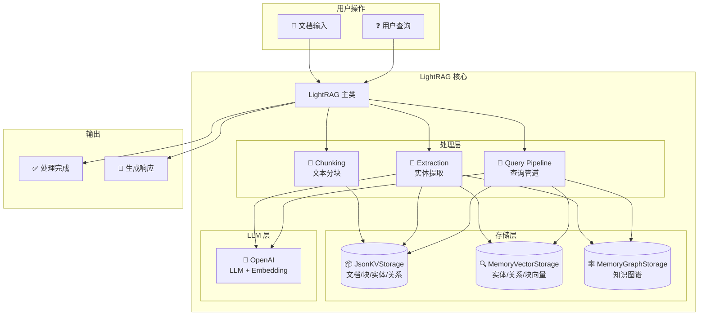

---

## 1. Ingest 流程（文档插入）

### 1.1 高层流程

```mermaid
flowchart TD
    subgraph 输入
        A[📄 原始文档<br/>string 或 string[]]
        B[⚙️ InsertOptions<br/>ids, filePaths, splitByCharacter]
    end

    subgraph 预处理阶段
        C[生成文档 ID<br/>computeMdhashId]
        D{文档是否<br/>已处理?}
        E[跳过]
        F[更新状态为<br/>processing]
    end

    subgraph 分块阶段
        G[📝 chunkingByTokenSize<br/>按 token 分块]
        H[添加文档 ID<br/>addDocIdToChunks]
        I[存储块到<br/>chunksKv]
    end

    subgraph 向量化阶段
        J[🔢 生成块嵌入<br/>embeddingFunc]
        K[存储到<br/>chunksVdb]
    end

    subgraph 实体提取阶段
        L[🤖 extractFromChunks<br/>调用 LLM]
        M[解析实体和关系]
    end

    subgraph 存储阶段
        N[合并实体描述]
        O[更新 graphStorage<br/>节点]
        P[更新 entitiesVdb<br/>向量]
        Q[合并关系描述]
        R[更新 graphStorage<br/>边]
        S[更新 relationsVdb<br/>向量]
    end

    subgraph 完成阶段
        T[更新状态为<br/>processed]
        U[commitChanges<br/>持久化]
        V[✅ 完成]
    end

    A --> C
    B --> C
    C --> D
    D -->|是| E
    D -->|否| F
    F --> G
    G --> H
    H --> I
    I --> J
    J --> K
    K --> L
    L --> M
    M --> N
    N --> O
    O --> P
    M --> Q
    Q --> R
    R --> S
    P --> T
    S --> T
    T --> U
    U --> V
```

### 1.2 详细步骤说明

#### Step 1: 文档预处理

```typescript
// 输入可以是单个文档或文档数组
const documents = Array.isArray(input) ? input : [input];

// 生成唯一文档 ID
const docId = computeMdhashId(doc, "doc-");
// 输出: "doc-a1b2c3d4e5f6..."

// 检查是否已处理
const existing = await docsKv.getById(docId);
if (existing?.status === "processed") {
  // 跳过已处理的文档
  continue;
}
```

#### Step 2: 文本分块

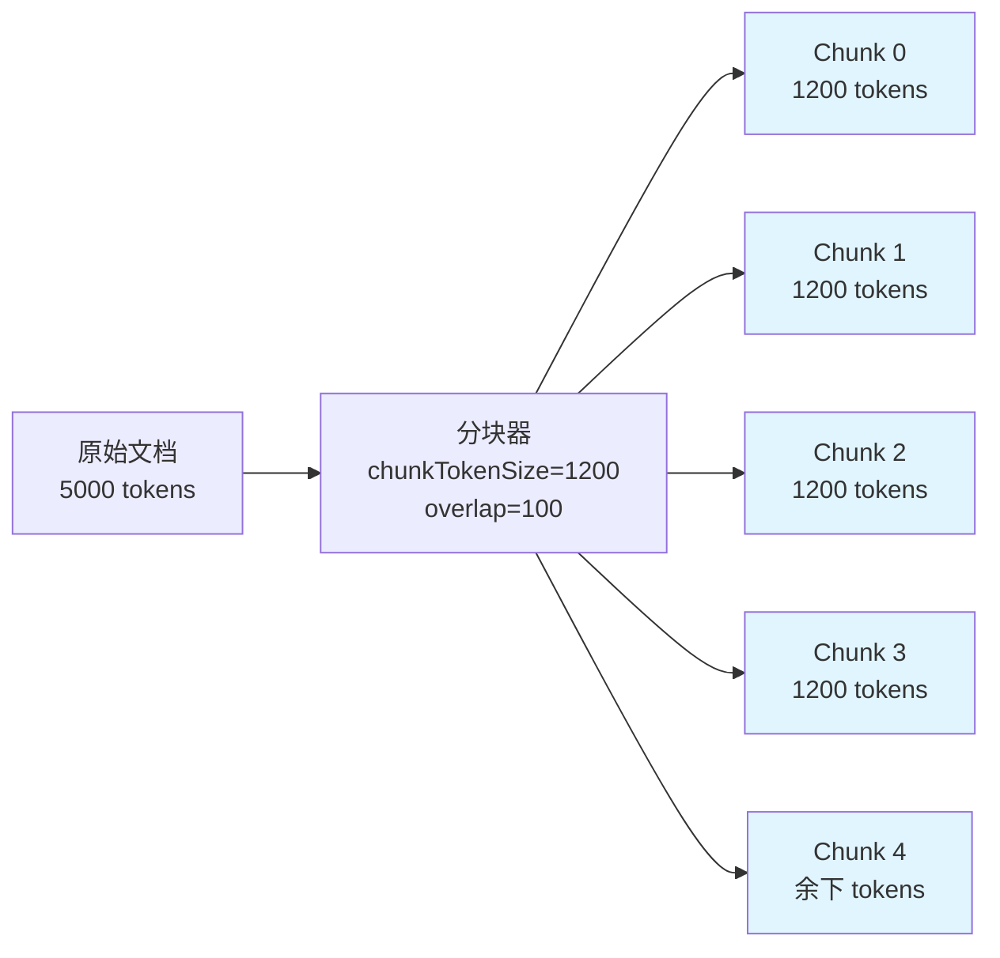

```typescript
const chunks = chunkingByTokenSize(tokenizer, doc, {
  chunkTokenSize: 1200, // 每块最大 token
  chunkOverlapTokenSize: 100, // 重叠 token
});
// 输出: [{ tokens: 1150, content: "...", chunkOrderIndex: 0 }, ...]
```

#### Step 3: 向量嵌入

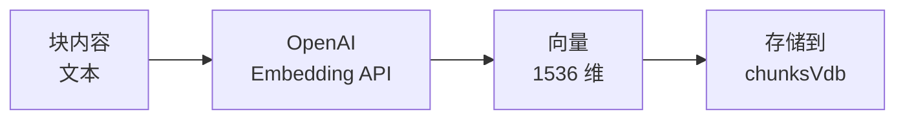

#### Step 4: 实体关系提取

```mermaid
flowchart TD
    A[块内容] --> B[构建 Prompt]
    B --> C[系统提示<br/>角色: 知识图谱专家]
    B --> D[用户提示<br/>包含实体类型和文本]
    C --> E[OpenAI<br/>Chat Completion]
    D --> E
    E --> F[解析响应]
    F --> G[实体列表]
    F --> H[关系列表]

    subgraph LLM 响应格式
        I[entity|名称|类型|描述]
        J[relation|源|目标|关键词|描述]
        K[COMPLETE]
    end

    F --> I
    F --> J
    F --> K
```

#### Step 5: 知识图谱更新

```mermaid
flowchart TB
    subgraph 实体处理
        A[实体列表] --> B[按名称分组]
        B --> C[合并描述<br/>mergeEntityDescriptions]
        C --> D[合并 sourceIds]
        D --> E[更新图节点<br/>graphStorage.upsertNode]
        E --> F[生成实体嵌入]
        F --> G[更新向量库<br/>entitiesVdb.upsert]
    end

    subgraph 关系处理
        H[关系列表] --> I[按 src-tgt 分组]
        I --> J[合并描述/关键词]
        J --> K[累加权重]
        K --> L[更新图边<br/>graphStorage.upsertEdge]
        L --> M[生成关系嵌入]
        M --> N[更新向量库<br/>relationsVdb.upsert]
    end
```

---

## 2. Update 流程（更新操作）

### 2.1 增量更新

LightRAG 使用**增量更新**策略，不会删除已有数据：

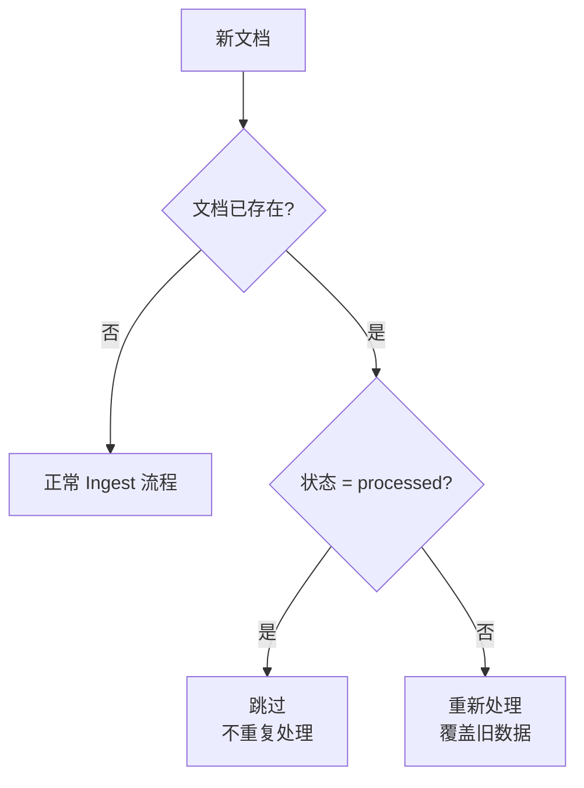

### 2.2 实体描述合并

当同一实体在多个文档中出现时：

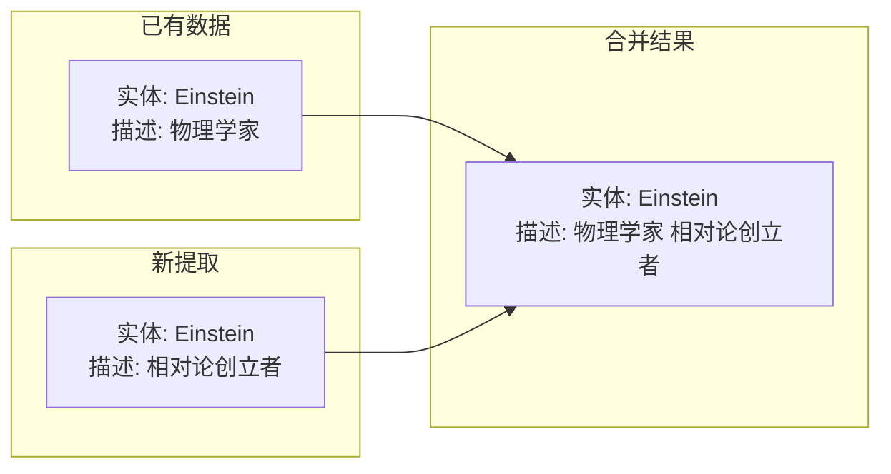

```typescript
// 描述合并逻辑
const existingNode = await graphStorage.getNode(entityName);
await graphStorage.upsertNode(entityName, {
  description: existingNode?.description
    ? `${existingNode.description} ${newDescription}`
    : newDescription,
  source_id: mergeSourceIds(existing, new),
});
```

### 2.3 关系权重累加

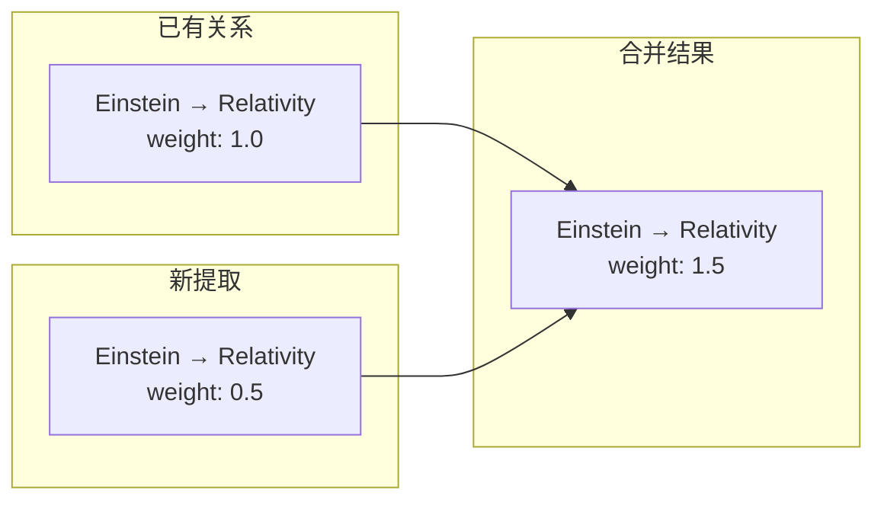

### 2.4 Source ID 管理

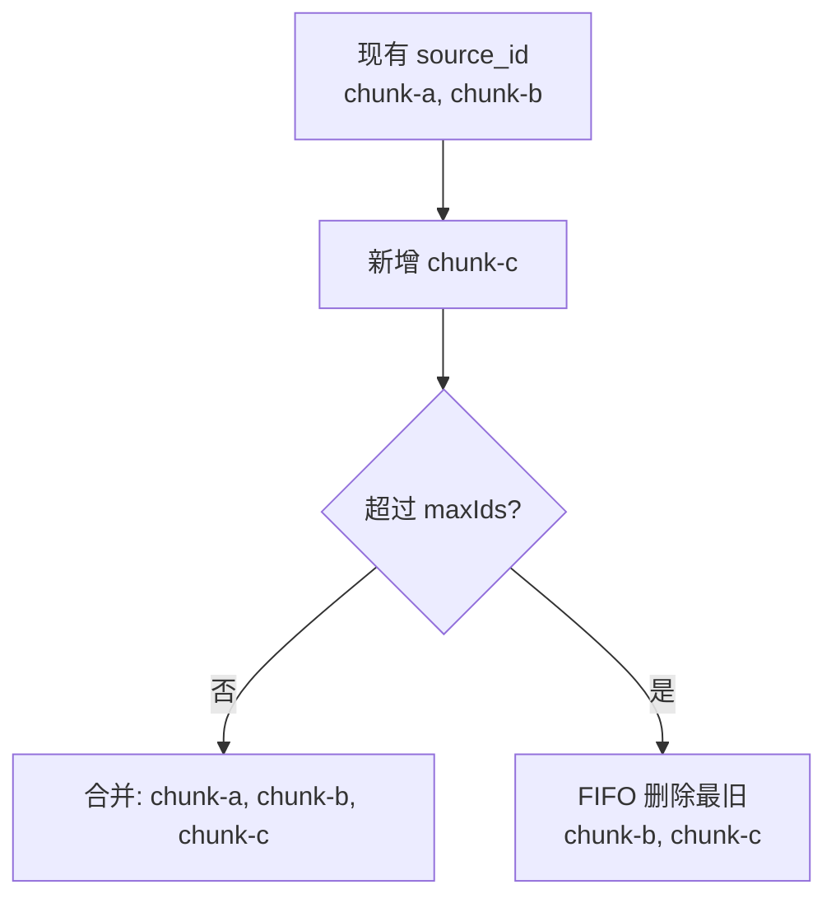

---

## 3. Query 流程（查询操作）

### 3.1 查询模式对比

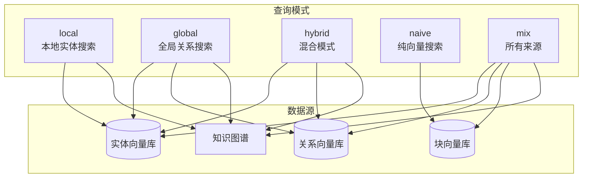

### 3.2 完整查询流程

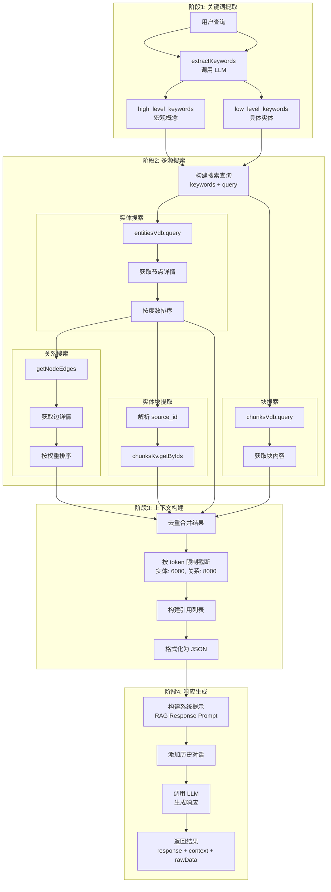

### 3.3 阶段详解

#### 阶段 1: 关键词提取

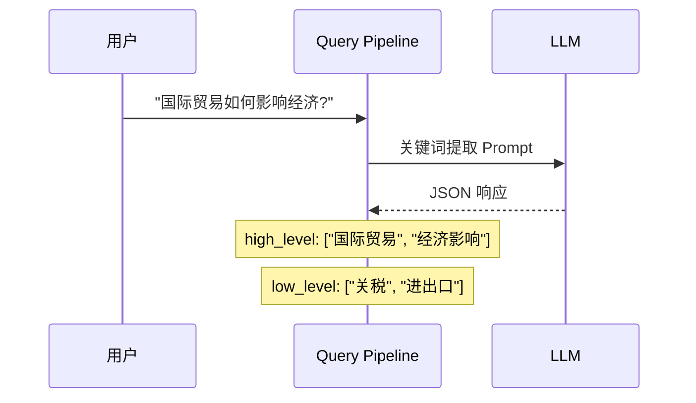

#### 阶段 2: 多源搜索

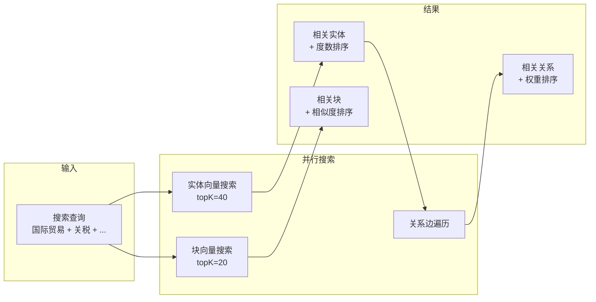

#### 阶段 3: 上下文构建

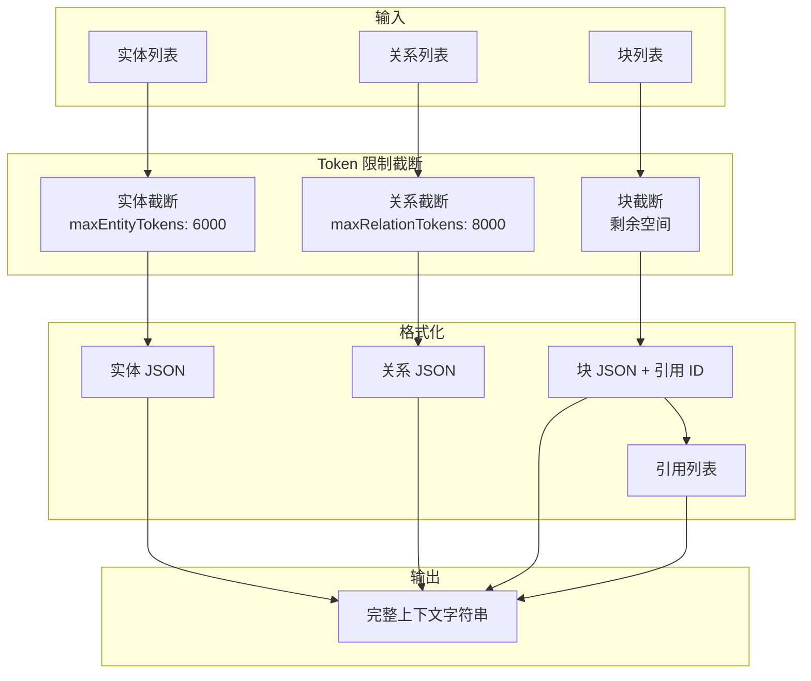

**上下文结构示例**:

```
Knowledge Graph Data (Entity):
[{"name": "Einstein", "type": "person", "description": "..."}]

Knowledge Graph Data (Relationship):
[{"source": "Einstein", "target": "Relativity", "description": "..."}]

Document Chunks (Each entry has a reference_id):
[{"reference_id": 1, "content": "..."}]

Reference Document List:
[1] einstein.txt
[2] physics.txt
```

#### 阶段 4: 响应生成

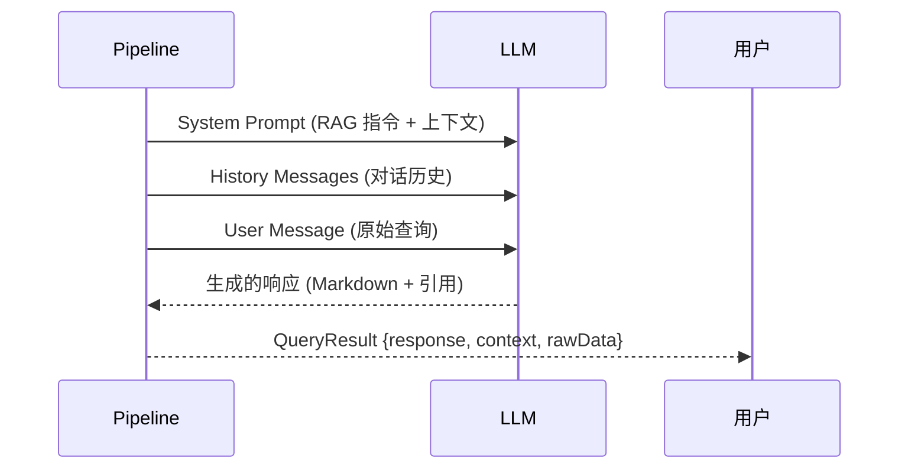

### 3.4 不同模式的数据流

#### Local 模式

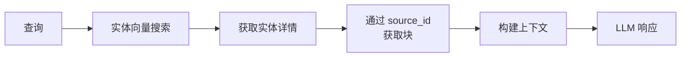

#### Global 模式

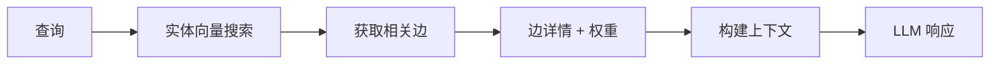

#### Hybrid 模式

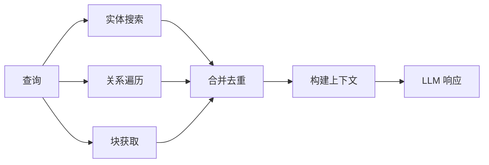

#### Naive 模式

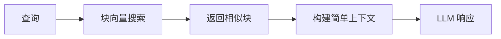

---

## 4. 数据持久化

### 4.1 存储结构

```mermaid
flowchart TB
    subgraph 文件系统
        A[workingDir/namespace/]
        B[docs.json<br/>文档状态]
        C[chunks.json<br/>文本块]
        D[entities_kv.json<br/>实体 KV]
        E[relations_kv.json<br/>关系 KV]
        F[entities_vdb.json<br/>实体向量]
        G[relations_vdb.json<br/>关系向量]
        H[chunks_vdb.json<br/>块向量]
        I[graph.json<br/>知识图谱]
        J[llm_cache.json<br/>LLM 缓存]
    end

    A --> B
    A --> C
    A --> D
    A --> E
    A --> F
    A --> G
    A --> H
    A --> I
    A --> J
```

### 4.2 持久化时机

```mermaid
sequenceDiagram
    participant O as 操作
    participant S as 存储
    participant F as 文件系统

    O->>S: upsert/delete
    Note over S: isDirty = true
    O->>S: indexDoneCallback()
    S->>F: 写入 JSON 文件
    Note over S: isDirty = false
    O->>S: finalize()
    S->>F: 最终持久化
```

---

## 5. 错误处理

### 5.1 Ingest 错误处理

```mermaid
flowchart TD
    A[处理文档] --> B{成功?}
    B -->|是| C[状态: processed]
    B -->|否| D[捕获错误]
    D --> E[状态: failed]
    E --> F[记录 errorMsg]
    F --> G[继续处理下一文档]
```

### 5.2 Query 错误处理

```mermaid
flowchart TD
    A[执行查询] --> B{有结果?}
    B -->|是| C[正常响应]
    B -->|否| D[返回 failResponse]
    D --> E["Sorry, I'm not able to..."]
```

---

## 6. 完整示例

```typescript
import LightRAG from "lightrag-ts";

async function example() {
  // 1. 初始化
  const rag = new LightRAG({
    workingDir: "./data",
    namespace: "demo",
    entityTypes: ["Person", "Concept", "Event"],
  });
  await rag.initialize();

  // 2. Ingest
  await rag.insert(
    `
    爱因斯坦在1905年发表了狭义相对论。
    这一理论彻底改变了物理学的基础。
  `,
    { filePaths: "physics.txt" }
  );

  // 3. Query
  const result = await rag.query("相对论是什么时候提出的?", {
    mode: "hybrid",
    topK: 10,
  });
  console.log(result.response);

  // 4. 获取图谱
  const kg = await rag.getKnowledgeGraph("爱因斯坦", 2);
  console.log(`${kg.nodes.length} 节点, ${kg.edges.length} 边`);

  // 5. 清理
  await rag.finalize();
}
```
